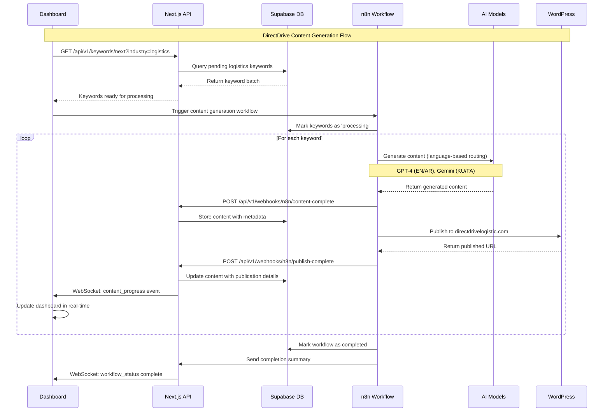
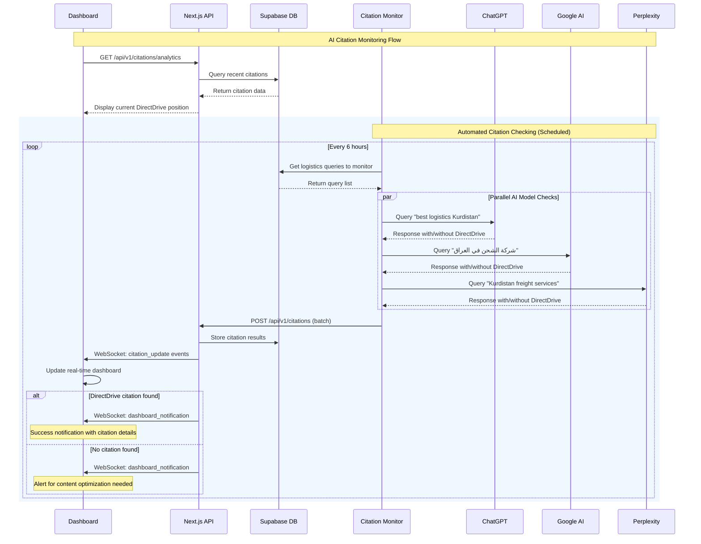
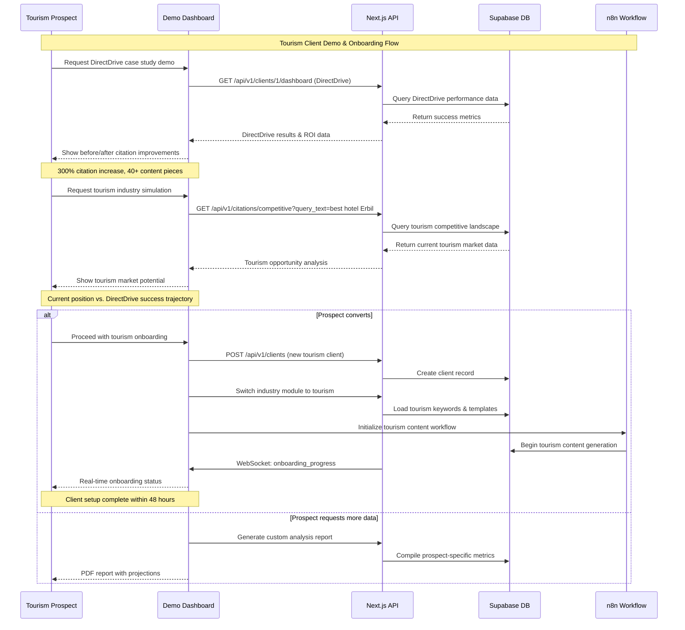
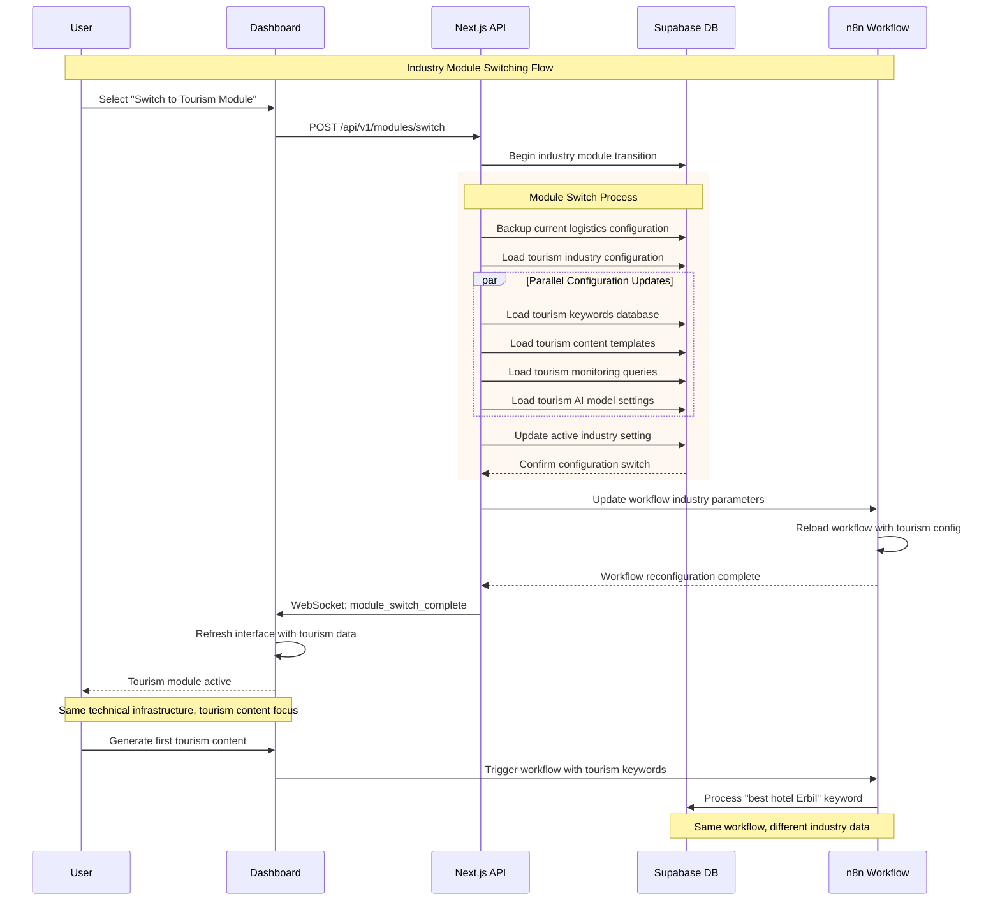

# Core Workflows

Based on your n8n workflow expertise and the DirectDrive Authority Engine requirements, these sequence diagrams illustrate the key system workflows including content generation, citation monitoring, and client demonstration processes.

## DirectDrive Content Generation & Publication

This workflow shows how your existing n8n workflow integrates with the new Supabase database and dashboard for DirectDrive logistics content generation.

## AI Citation Monitoring & Business Validation

This workflow demonstrates the real-time citation monitoring system that validates DirectDrive's AI authority improvements.

## Tourism Client Demonstration & Onboarding

This workflow shows how DirectDrive success data is used to demonstrate capabilities to tourism prospects and onboard new clients.

## Industry Module Switching (Logistics → Tourism)

This workflow demonstrates the modular architecture's capability to switch from DirectDrive logistics to tourism industry focus without technical changes.

**Core Workflows Rationale:**
These sequence diagrams illustrate how your existing n8n workflow expertise integrates seamlessly with modern web application patterns. The workflows demonstrate the BUILD → PROVE → SELL strategy in action: DirectDrive content generation proves the system works, citation monitoring validates business impact, and tourism demonstrations convert prospects using real evidence.

---
