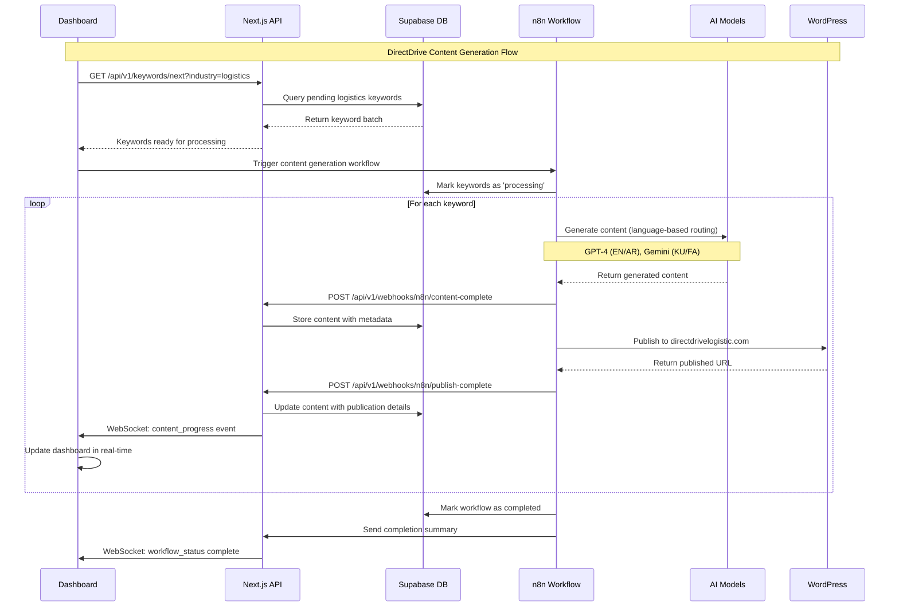
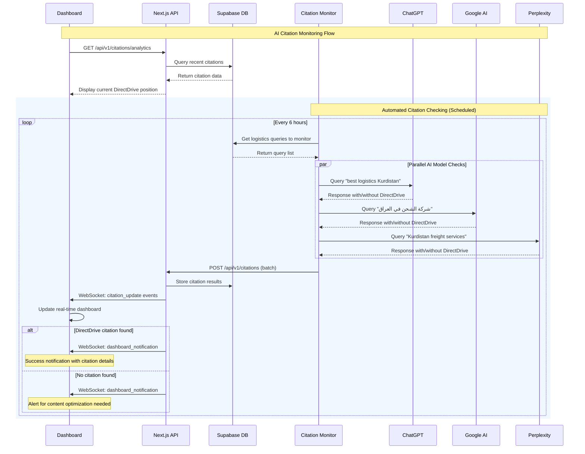
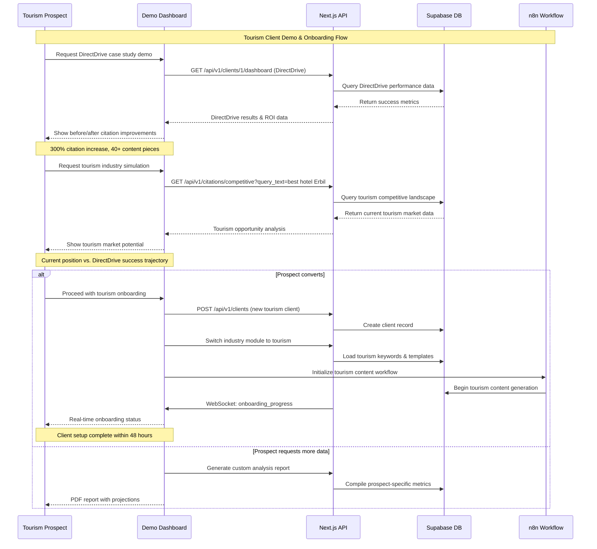
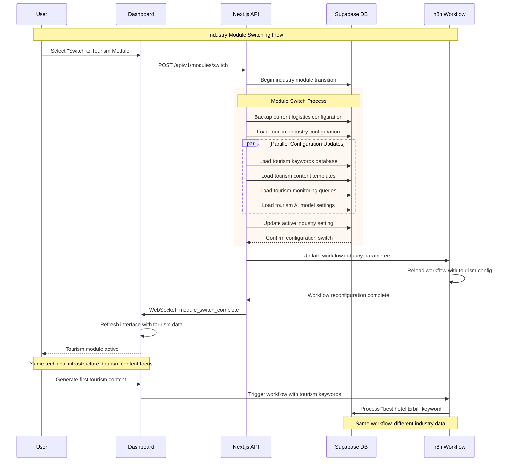
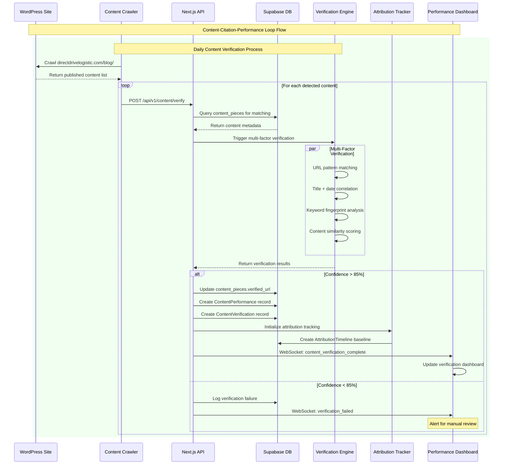
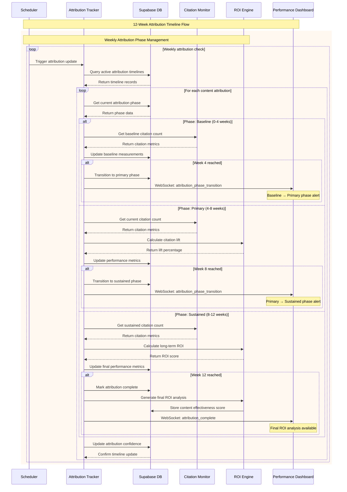
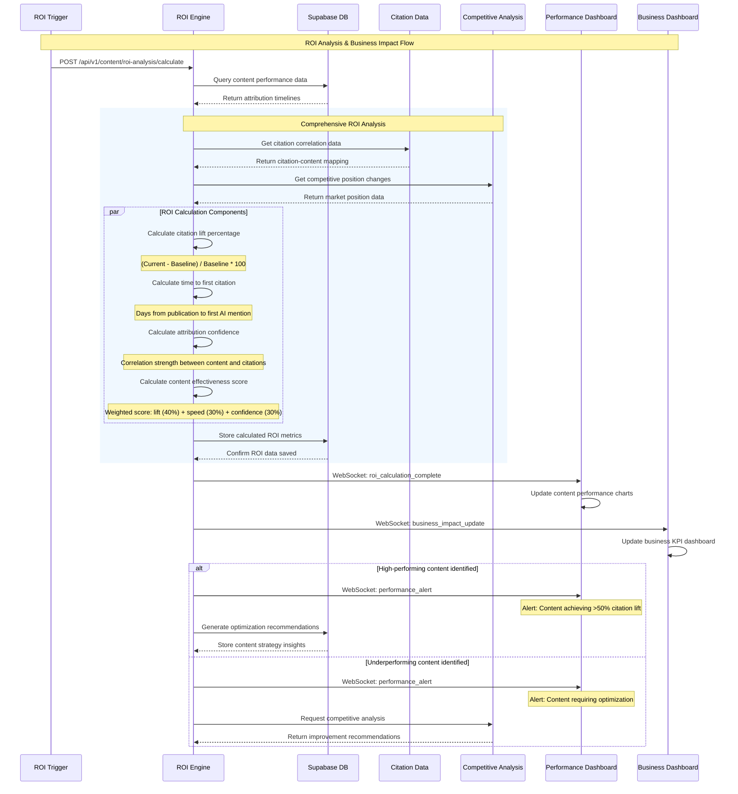
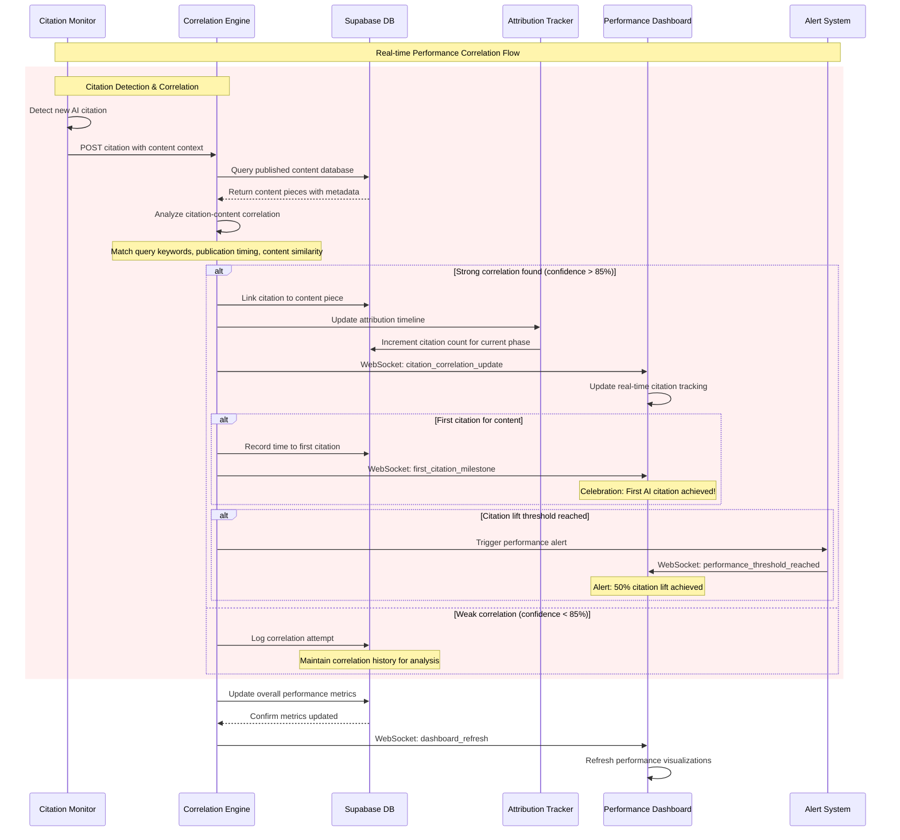

# Core Workflows

Based on your n8n workflow expertise and the DirectDrive Authority Engine requirements, these sequence diagrams illustrate the key system workflows including content generation, citation monitoring, and client demonstration processes.

## DirectDrive Content Generation & Publication

This workflow shows how your existing n8n workflow integrates with the new Supabase database and dashboard for DirectDrive logistics content generation.

## AI Citation Monitoring & Business Validation

This workflow demonstrates the real-time citation monitoring system that validates DirectDrive's AI authority improvements.

## Tourism Client Demonstration & Onboarding

This workflow shows how DirectDrive success data is used to demonstrate capabilities to tourism prospects and onboard new clients.

## Industry Module Switching (Logistics → Tourism)

This workflow demonstrates the modular architecture's capability to switch from DirectDrive logistics to tourism industry focus without technical changes.

## Story 1.5: Content-Citation-Performance Loop Workflows

### Content Verification & Attribution Tracking

This workflow demonstrates the new multi-factor content verification system and 12-week attribution tracking for measuring content performance correlation.

### 12-Week Attribution Timeline Management

This workflow shows how the attribution tracking system manages the three phases of content performance measurement.

### ROI Analysis & Business Impact Correlation

This workflow demonstrates how the system correlates content performance with business impact through automated ROI calculation.

### Real-time Performance Correlation Updates

This workflow shows how the system provides real-time correlation between published content and AI citation improvements.

**Story 1.5 Workflows Rationale:**
These enhanced sequence diagrams demonstrate the new Content-Citation-Performance Loop monitoring capabilities that transform DirectDrive's content strategy from manual tracking to automated correlation analysis. The workflows provide real-time verification of published content, systematic attribution tracking through 12-week phases, and quantifiable ROI measurement that directly supports business decision-making. The integration maintains compatibility with existing Stories 1.1-1.4 infrastructure while adding sophisticated performance monitoring that enables data-driven content optimization.

**Core Workflows Rationale:**
These sequence diagrams illustrate how your existing n8n workflow expertise integrates seamlessly with modern web application patterns. The workflows demonstrate the BUILD → PROVE → SELL strategy in action: DirectDrive content generation proves the system works, citation monitoring validates business impact, and tourism demonstrations convert prospects using real evidence. The new Story 1.5 workflows extend this foundation with automated performance correlation, providing the quantifiable metrics needed for strategic content optimization and business growth validation.

---
