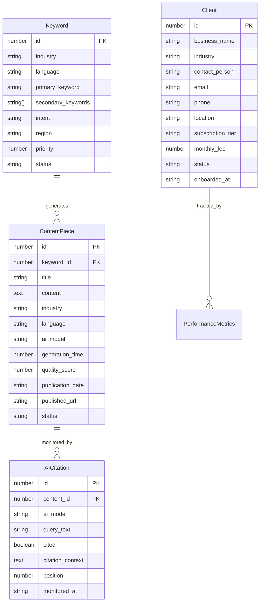

# Data Models

Based on your implemented Supabase database schema and the DirectDrive Authority Engine requirements, these core data models are shared between frontend dashboard, n8n workflows, and API integrations.

## Core Business Entities

The data models are designed around your industry-agnostic database schema, supporting both DirectDrive logistics and future tourism industry modules.

## Keyword

**Purpose:** Manages industry-specific keywords across multiple languages for AI content generation targeting different cultural markets.

**Key Attributes:**
- `id`: number - Primary key for keyword identification
- `industry`: string - Industry classification (logistics, tourism, healthcare)
- `language`: string - Language code (en, ar, ku, fa) for cultural targeting
- `primary_keyword`: string - Main search term for content generation
- `secondary_keywords`: string[] - Supporting keywords for content context
- `intent`: string - Search intent classification (commercial, informational, navigational)
- `region`: string - Geographic targeting (Kurdistan, Iraq, MENA)
- `priority`: number - Content generation priority ranking
- `status`: string - Processing status (pending, processing, completed)

### TypeScript Interface
```typescript
interface Keyword {
  id: number;
  industry: 'logistics' | 'tourism' | 'healthcare';
  language: 'en' | 'ar' | 'ku' | 'fa';
  primary_keyword: string;
  secondary_keywords: string[];
  intent: 'commercial' | 'informational' | 'navigational';
  region: string;
  priority: number;
  status: 'pending' | 'processing' | 'completed';
  created_at: string;
  updated_at: string;
}
```

### Relationships
- One-to-many with ContentPiece (keyword generates multiple content pieces)
- Referenced by n8n workflows for content generation triggers

## ContentPiece

**Purpose:** Tracks generated content pieces with AI model attribution, quality metrics, and publication status for ROI analysis.

**Key Attributes:**
- `id`: number - Unique content identifier
- `keyword_id`: number - Reference to source keyword
- `title`: string - Generated content title
- `content`: string - Full generated content body
- `industry`: string - Industry classification for modular management
- `language`: string - Content language for cultural appropriateness
- `ai_model`: string - AI model used for generation (gpt-4, gemini-pro)
- `generation_time`: number - Processing time in seconds for performance tracking
- `quality_score`: number - Content quality rating (0-100)
- `publication_date`: string - WordPress publication timestamp
- `published_url`: string - DirectDrive website URL for citation tracking

### TypeScript Interface
```typescript
interface ContentPiece {
  id: number;
  keyword_id: number;
  title: string;
  content: string;
  industry: string;
  language: string;
  ai_model: 'gpt-4' | 'gemini-pro' | 'gpt-4-turbo';
  generation_time?: number;
  quality_score?: number;
  publication_date?: string;
  published_url?: string;
  status: 'draft' | 'published' | 'archived';
  created_at: string;
}
```

### Relationships
- Many-to-one with Keyword (content generated from keyword)
- One-to-many with AICitation (content can have multiple citations)
- Published to WordPress via REST API

## AICitation

**Purpose:** Monitors and tracks DirectDrive mentions across AI models for business validation and competitive analysis.

**Key Attributes:**
- `id`: number - Citation record identifier
- `content_id`: number - Reference to source content piece
- `ai_model`: string - AI model where citation was found
- `query_text`: string - Search query that triggered citation
- `cited`: boolean - Whether DirectDrive was mentioned
- `citation_context`: string - Surrounding text context
- `position`: number - Ranking position in AI response
- `monitored_at`: string - Citation check timestamp

### TypeScript Interface
```typescript
interface AICitation {
  id: number;
  content_id?: number;
  ai_model: 'chatgpt' | 'google-ai' | 'perplexity';
  query_text: string;
  cited: boolean;
  citation_context?: string;
  position?: number;
  monitored_at: string;
}
```

### Relationships
- Many-to-one with ContentPiece (citations link to published content)
- Aggregated for business analytics and ROI calculations

## Client

**Purpose:** Manages DirectDrive and future tourism clients with subscription tracking and performance attribution.

**Key Attributes:**
- `id`: number - Client identifier
- `business_name`: string - Client business name
- `industry`: string - Industry classification
- `contact_person`: string - Primary contact
- `subscription_tier`: string - Service level (basic, premium, enterprise)
- `monthly_fee`: number - Revenue tracking
- `status`: string - Account status

### TypeScript Interface
```typescript
interface Client {
  id: number;
  business_name: string;
  industry: string;
  contact_person?: string;
  email?: string;
  phone?: string;
  location?: string;
  subscription_tier?: string;
  monthly_fee?: number;
  status: 'active' | 'inactive' | 'trial';
  onboarded_at: string;
}
```

### Relationships
- One-to-many with PerformanceMetrics (client performance tracking)
- Industry tagging enables modular content management

## Data Model Relationships



**Data Architecture Rationale:**
These data models directly reflect your implemented Supabase schema while adding TypeScript interfaces for type safety across the stack. The industry-agnostic design supports the modular framework allowing easy switching between DirectDrive logistics and tourism content without database schema changes. The relationships enable comprehensive tracking from keyword → content → citation → business impact, supporting the BUILD → PROVE → SELL strategy with measurable ROI data.

---
