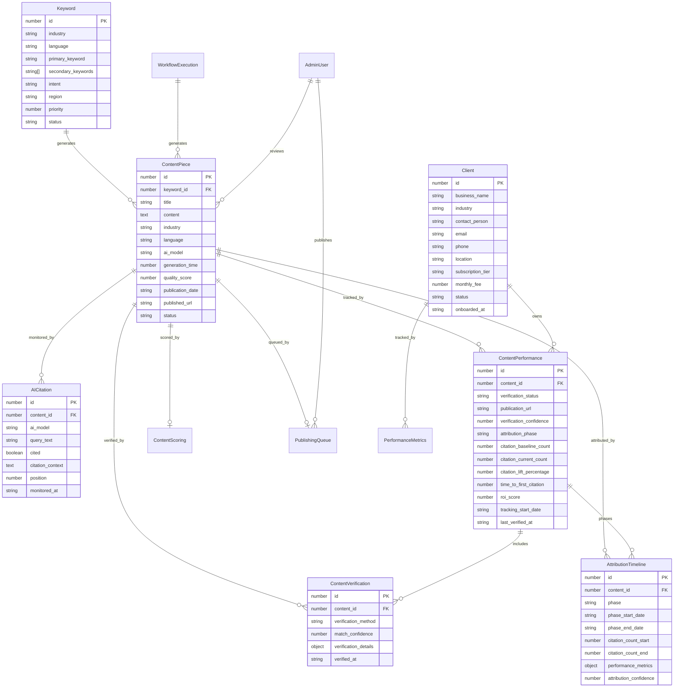

# Data Models

Based on your implemented Supabase database schema and the DirectDrive Authority Engine requirements, these enhanced data models support the admin panel workflow system, real-time scoring, publishing queue management, and n8n workflow integrations.

## Core Business Entities

The data models are designed around your industry-agnostic database schema, supporting both DirectDrive logistics and future tourism industry modules.

## Keyword

**Purpose:** Manages industry-specific keywords across multiple languages for AI content generation targeting different cultural markets.

**Key Attributes:**
- `id`: number - Primary key for keyword identification
- `industry`: string - Industry classification (logistics, tourism, healthcare)
- `language`: string - Language code (en, ar, ku, fa) for cultural targeting
- `primary_keyword`: string - Main search term for content generation
- `secondary_keywords`: string[] - Supporting keywords for content context
- `intent`: string - Search intent classification (commercial, informational, navigational)
- `region`: string - Geographic targeting (Kurdistan, Iraq, MENA)
- `priority`: number - Content generation priority ranking
- `status`: string - Processing status (pending, processing, completed, under_review)

### TypeScript Interface
```typescript
interface Keyword {
  id: number;
  industry: 'logistics' | 'tourism' | 'healthcare';
  language: 'en' | 'ar' | 'ku' | 'fa';
  primary_keyword: string;
  secondary_keywords: string[];
  intent: 'commercial' | 'informational' | 'navigational';
  region: string;
  priority: number;
  status: 'pending' | 'processing' | 'completed' | 'under_review';
  created_at: string;
  updated_at: string;
}
```

### Relationships
- One-to-many with ContentPiece (keyword generates multiple content pieces)
- Referenced by n8n workflows for content generation triggers

## ContentPiece

**Purpose:** Tracks generated content pieces with AI model attribution, quality metrics, and publication status for ROI analysis.

**Key Attributes:**
- `id`: number - Unique content identifier
- `keyword_id`: number - Reference to source keyword
- `title`: string - Generated content title
- `content`: string - Full generated content body
- `industry`: string - Industry classification for modular management
- `language`: string - Content language for cultural appropriateness
- `ai_model`: string - AI model used for generation (gpt-4, gemini-pro)
- `generation_time`: number - Processing time in seconds for performance tracking
- `quality_score`: number - Content quality rating (0-100)
- `publication_date`: string - WordPress publication timestamp
- `published_url`: string - DirectDrive website URL for citation tracking
- `assigned_reviewer`: string - Admin user assigned for content review
- `review_notes`: string - Reviewer comments and feedback
- `seo_score`: number - Real-time SEO scoring (0-100)
- `score_breakdown`: object - Detailed scoring components (JSON)
- `approval_timestamp`: string - When content was approved for publishing
- `scheduled_publish_date`: string - Scheduled publication date and time
- `workflow_state`: string - Current position in admin panel workflow
- `priority_score`: number - Content priority ranking for review queue

### TypeScript Interface
```typescript
interface ContentPiece {
  id: number;
  keyword_id: number;
  title: string;
  content: string;
  industry: string;
  language: string;
  ai_model: 'gpt-4' | 'gemini-pro' | 'gpt-4-turbo';
  generation_time?: number;
  quality_score?: number;
  publication_date?: string;
  published_url?: string;
  status: 'generated' | 'under_review' | 'approved' | 'scheduled' | 'published' | 'archived';
  assigned_reviewer?: string;
  review_notes?: string;
  workflow_state: 'pending_review' | 'in_review' | 'pending_approval' | 'approved' | 'scheduled' | 'published';
  priority_score: number; // 1-10, higher = more urgent
  seo_score: number; // 0-100
  score_breakdown: {
    content_quality: number;
    seo_optimization: number;
    readability: number;
    keyword_density: number;
    internal_links: number;
    external_links: number;
    image_optimization: number;
    meta_optimization: number;
  };
  approval_timestamp?: string;
  scheduled_publish_date?: string;
  created_at: string;
}
```

### Relationships
- Many-to-one with Keyword (content generated from keyword)
- One-to-many with AICitation (content can have multiple citations)
- Published to WordPress via REST API

## AICitation

**Purpose:** Monitors and tracks DirectDrive mentions across AI models for business validation and competitive analysis.

**Key Attributes:**
- `id`: number - Citation record identifier
- `content_id`: number - Reference to source content piece
- `ai_model`: string - AI model where citation was found
- `query_text`: string - Search query that triggered citation
- `cited`: boolean - Whether DirectDrive was mentioned
- `citation_context`: string - Surrounding text context
- `position`: number - Ranking position in AI response
- `monitored_at`: string - Citation check timestamp

### TypeScript Interface
```typescript
interface AICitation {
  id: number;
  content_id?: number;
  ai_model: 'chatgpt' | 'google-ai' | 'perplexity';
  query_text: string;
  cited: boolean;
  citation_context?: string;
  position?: number;
  monitored_at: string;
}
```

### Relationships
- Many-to-one with ContentPiece (citations link to published content)
- One-to-many with AttributionTimeline (citations tracked across attribution phases)
- Aggregated for business analytics and ROI calculations

## Client

**Purpose:** Manages DirectDrive and future tourism clients with subscription tracking and performance attribution.

**Key Attributes:**
- `id`: number - Client identifier
- `business_name`: string - Client business name
- `industry`: string - Industry classification
- `contact_person`: string - Primary contact
- `subscription_tier`: string - Service level (basic, premium, enterprise)
- `monthly_fee`: number - Revenue tracking
- `status`: string - Account status

### TypeScript Interface
```typescript
interface Client {
  id: number;
  business_name: string;
  industry: string;
  contact_person?: string;
  email?: string;
  phone?: string;
  location?: string;
  subscription_tier?: string;
  monthly_fee?: number;
  status: 'active' | 'inactive' | 'trial';
  onboarded_at: string;
}
```

### Relationships
- One-to-many with PerformanceMetrics (client performance tracking)
- One-to-many with ContentPerformance (client content attribution tracking)
- Industry tagging enables modular content management

## ContentPerformance

**Purpose:** Tracks content publication verification and performance correlation with AI citation improvements through 12-week attribution timeline.

**Key Attributes:**
- `id`: number - Performance record identifier
- `content_id`: number - Reference to source content piece
- `verification_status`: string - Content publication verification status
- `publication_url`: string - Verified publication URL on directdrivelogistic.com
- `verification_confidence`: number - Multi-factor matching confidence score (0-100%)
- `attribution_phase`: string - Current tracking phase (baseline, primary, sustained, completed)
- `citation_baseline_count`: number - Initial citation count before content publication
- `citation_current_count`: number - Current citation count for ROI calculation
- `citation_lift_percentage`: number - Calculated citation improvement percentage
- `time_to_first_citation`: number - Days from publication to first AI citation
- `roi_score`: number - Calculated content effectiveness score

### TypeScript Interface
```typescript
interface ContentPerformance {
  id: number;
  content_id: number;
  verification_status: 'pending' | 'verified' | 'not_found' | 'error';
  publication_url?: string;
  verification_confidence: number; // 0-100%
  attribution_phase: 'baseline' | 'primary' | 'sustained' | 'completed';
  citation_baseline_count: number;
  citation_current_count: number;
  citation_lift_percentage: number;
  time_to_first_citation?: number; // days
  roi_score: number;
  tracking_start_date: string;
  last_verified_at: string;
  created_at: string;
  updated_at: string;
}
```

### Relationships
- Many-to-one with ContentPiece (performance tracking for published content)
- One-to-many with ContentVerification (multiple verification attempts)
- One-to-many with AttributionTimeline (tracking across attribution phases)
- Many-to-one with Client (client-specific performance analysis)

## ContentVerification

**Purpose:** Records multi-factor content verification attempts using URL tracking, title+date correlation, keyword fingerprinting, and content similarity analysis.

**Key Attributes:**
- `id`: number - Verification record identifier
- `content_id`: number - Reference to content being verified
- `verification_method`: string - Method used for verification attempt
- `match_confidence`: number - Confidence score for this specific verification method
- `verification_details`: object - Method-specific matching data and metadata
- `verified_at`: string - Timestamp of verification attempt

### TypeScript Interface
```typescript
interface ContentVerification {
  id: number;
  content_id: number;
  verification_method: 'url_tracking' | 'title_date' | 'keyword_fingerprint' | 'content_similarity';
  match_confidence: number; // 0-100%
  verification_details: {
    url_pattern?: string;
    title_match_score?: number;
    date_proximity?: number;
    keyword_density?: number;
    similarity_score?: number;
    metadata?: object;
  };
  verified_at: string;
  created_at: string;
}
```

### Relationships
- Many-to-one with ContentPiece (verification attempts for content)
- Many-to-one with ContentPerformance (verification data for performance tracking)

## AttributionTimeline

**Purpose:** Manages 12-week attribution tracking with three distinct phases for measuring long-term content impact on AI citation frequency.

**Key Attributes:**
- `id`: number - Timeline record identifier
- `content_id`: number - Reference to tracked content piece
- `phase`: string - Attribution phase (baseline, primary, sustained)
- `phase_start_date`: string - Phase commencement date
- `phase_end_date`: string - Phase completion date
- `citation_count_start`: number - Citations at phase beginning
- `citation_count_end`: number - Citations at phase conclusion
- `performance_metrics`: object - Phase-specific performance data
- `attribution_confidence`: number - Confidence in attribution correlation (0-100%)

### TypeScript Interface
```typescript
interface AttributionTimeline {
  id: number;
  content_id: number;
  phase: 'baseline' | 'primary' | 'sustained';
  phase_start_date: string;
  phase_end_date: string;
  citation_count_start: number;
  citation_count_end: number;
  performance_metrics: {
    citation_lift?: number;
    daily_average_citations?: number;
    peak_citation_day?: string;
    competitive_position_change?: number;
    search_ranking_improvements?: object;
  };
  attribution_confidence: number; // 0-100%
  created_at: string;
  updated_at: string;
}
```

### Relationships
- Many-to-one with ContentPiece (timeline tracking for content)
- Many-to-one with ContentPerformance (attribution data for performance analysis)
- One-to-many with AICitation (citations aggregated by attribution phase)

## WorkflowExecution

**Purpose:** Tracks n8n workflow executions with admin panel integration points and performance metrics.

**Key Attributes:**
- `id`: number - Unique execution identifier
- `workflow_id`: string - n8n workflow ID (VVAuXhF9yGXIGqjy)
- `execution_id`: string - n8n execution instance ID
- `trigger_type`: string - Execution trigger (scheduled, manual, webhook)
- `content_ids`: number[] - Generated content piece IDs
- `execution_status`: string - Current execution status
- `start_time`: string - Workflow execution start timestamp
- `end_time`: string - Workflow execution completion timestamp
- `duration_seconds`: number - Total execution time
- `node_count`: number - Total nodes executed (29+ nodes)
- `error_details`: object - Error information if execution failed
- `webhook_payload`: object - Webhook data sent to admin panel

### TypeScript Interface
```typescript
interface WorkflowExecution {
  id: number;
  workflow_id: string;
  execution_id: string;
  trigger_type: 'scheduled' | 'manual' | 'webhook' | 'queue_triggered';
  content_ids: number[];
  execution_status: 'running' | 'completed' | 'failed' | 'cancelled';
  start_time: string;
  end_time?: string;
  duration_seconds?: number;
  node_count: number;
  error_details?: object;
  webhook_payload?: object;
  created_at: string;
}
```

### Relationships
- One-to-many with ContentPiece (execution generates multiple content pieces)
- References n8n workflow via workflow_id
- Tracked by admin panel for execution monitoring

## PublishingQueue

**Purpose:** Manages content publishing schedule with business event alignment and queue processing.

**Key Attributes:**
- `id`: number - Queue entry identifier
- `content_id`: number - Reference to content piece
- `scheduled_date`: string - Planned publication date and time
- `priority`: number - Publication priority ranking (1-10)
- `queue_status`: string - Current queue processing status
- `business_event`: string - Associated business event or campaign
- `publication_platform`: string - Target publishing platform
- `assigned_publisher`: string - Team member responsible for publication
- `retry_count`: number - Number of publication attempts
- `last_retry_at`: string - Last publication attempt timestamp
- `success_timestamp`: string - Successful publication timestamp
- `failure_reason`: string - Failure details if publication failed
- `queue_metadata`: object - Additional queue processing data

### TypeScript Interface
```typescript
interface PublishingQueue {
  id: number;
  content_id: number;
  scheduled_date: string;
  priority: number; // 1-10, higher = more important
  queue_status: 'pending' | 'processing' | 'completed' | 'failed' | 'cancelled';
  business_event?: string;
  publication_platform: 'wordpress' | 'directdrive' | 'both';
  assigned_publisher?: string;
  retry_count: number;
  last_retry_at?: string;
  success_timestamp?: string;
  failure_reason?: string;
  queue_metadata: {
    estimated_processing_time?: number;
    publication_batch?: string;
    campaign_id?: string;
    content_series?: string;
  };
  created_at: string;
  updated_at: string;
}
```

### Relationships
- Many-to-one with ContentPiece (queue entry for specific content)
- Referenced by admin panel publishing management
- Processed by scheduling engine and notification system

## ContentScoring

**Purpose:** Real-time SEO and content quality scoring with component-level breakdown and optimization recommendations.

**Key Attributes:**
- `id`: number - Scoring record identifier
- `content_id`: number - Reference to content piece
- `overall_score`: number - Total content score (0-100)
- `scoring_components`: object - Detailed component scores
- `optimization_suggestions`: string[] - Actionable improvement recommendations
- `scoring_model_version`: string - Version of scoring algorithm used
- `last_scored_at`: string - Most recent scoring timestamp
- `score_history`: object[] - Historical scoring data for trend analysis
- `manual_adjustments`: object - Admin-applied score modifications
- `competitor_comparison`: object - Scoring relative to competitor content

### TypeScript Interface
```typescript
interface ContentScoring {
  id: number;
  content_id: number;
  overall_score: number; // 0-100
  scoring_components: {
    content_quality: number;
    seo_optimization: number;
    readability: number;
    keyword_density: number;
    internal_links: number;
    external_links: number;
    image_optimization: number;
    meta_optimization: number;
    structure_quality: number;
    engagement_potential: number;
  };
  optimization_suggestions: string[];
  scoring_model_version: string;
  last_scored_at: string;
  score_history: Array<{
    score: number;
    timestamp: string;
    version: string;
  }>;
  manual_adjustments?: {
    adjusted_by: string;
    adjustment_reason: string;
    original_score: number;
    adjusted_score: number;
  };
  competitor_comparison?: {
    industry_average: number;
    top_performer_score: number;
    ranking_percentile: number;
  };
  created_at: string;
  updated_at: string;
}
```

### Relationships
- One-to-one with ContentPiece (scoring for specific content)
- Updated by real-time scoring engine
- Displayed in admin panel SEO tab

## WorkflowExecution

**Purpose:** Tracks n8n workflow executions with admin panel integration points and performance metrics.

**Key Attributes:**
- `id`: number - Unique execution identifier
- `workflow_id`: string - n8n workflow ID (VVAuXhF9yGXIGqjy)
- `execution_id`: string - n8n execution instance ID
- `trigger_type`: string - Execution trigger (scheduled, manual, webhook)
- `content_ids`: number[] - Generated content piece IDs
- `execution_status`: string - Current execution status
- `start_time`: string - Workflow execution start timestamp
- `end_time`: string - Workflow execution completion timestamp
- `duration_seconds`: number - Total execution time
- `node_count`: number - Total nodes executed (29+ nodes)
- `error_details`: object - Error information if execution failed
- `webhook_payload`: object - Webhook data sent to admin panel

### TypeScript Interface
```typescript
interface WorkflowExecution {
  id: number;
  workflow_id: string;
  execution_id: string;
  trigger_type: 'scheduled' | 'manual' | 'webhook' | 'queue_triggered';
  content_ids: number[];
  execution_status: 'running' | 'completed' | 'failed' | 'cancelled';
  start_time: string;
  end_time?: string;
  duration_seconds?: number;
  node_count: number;
  error_details?: object;
  webhook_payload?: object;
  created_at: string;
}
```

### Relationships
- One-to-many with ContentPiece (execution generates multiple content pieces)
- References n8n workflow via workflow_id
- Tracked by admin panel for execution monitoring

## PublishingQueue

**Purpose:** Manages content publishing schedule with business event alignment and queue processing.

**Key Attributes:**
- `id`: number - Queue entry identifier
- `content_id`: number - Reference to content piece
- `scheduled_date`: string - Planned publication date and time
- `priority`: number - Publication priority ranking (1-10)
- `queue_status`: string - Current queue processing status
- `business_event`: string - Associated business event or campaign
- `publication_platform`: string - Target publishing platform
- `assigned_publisher`: string - Team member responsible for publication
- `retry_count`: number - Number of publication attempts
- `last_retry_at`: string - Last publication attempt timestamp
- `success_timestamp`: string - Successful publication timestamp
- `failure_reason`: string - Failure details if publication failed
- `queue_metadata`: object - Additional queue processing data

### TypeScript Interface
```typescript
interface PublishingQueue {
  id: number;
  content_id: number;
  scheduled_date: string;
  priority: number; // 1-10, higher = more important
  queue_status: 'pending' | 'processing' | 'completed' | 'failed' | 'cancelled';
  business_event?: string;
  publication_platform: 'wordpress' | 'directdrive' | 'both';
  assigned_publisher?: string;
  retry_count: number;
  last_retry_at?: string;
  success_timestamp?: string;
  failure_reason?: string;
  queue_metadata: {
    estimated_processing_time?: number;
    publication_batch?: string;
    campaign_id?: string;
    content_series?: string;
  };
  created_at: string;
  updated_at: string;
}
```

### Relationships
- Many-to-one with ContentPiece (queue entry for specific content)
- Referenced by admin panel publishing management
- Processed by scheduling engine and notification system

## AdminUser

**Purpose:** Manages admin panel users with role-based permissions and review assignment tracking.

**Key Attributes:**
- `id`: number - User identifier
- `username`: string - Login username
- `email`: string - User email address
- `role`: string - Admin role and permissions level
- `permissions`: string[] - Specific permission flags
- `assigned_content_count`: number - Currently assigned content pieces
- `review_capacity`: number - Maximum concurrent reviews
- `notification_preferences`: object - User notification settings
- `last_active_at`: string - Last admin panel activity
- `review_statistics`: object - Performance metrics for reviews

### TypeScript Interface
```typescript
interface AdminUser {
  id: number;
  username: string;
  email: string;
  role: 'super_admin' | 'content_manager' | 'reviewer' | 'publisher';
  permissions: Array<
    'review_content' | 'approve_content' | 'schedule_publishing' | 
    'manage_queue' | 'view_analytics' | 'manage_users' | 'system_settings'
  >;
  assigned_content_count: number;
  review_capacity: number;
  notification_preferences: {
    email_enabled: boolean;
    telegram_enabled: boolean;
    in_app_enabled: boolean;
    notification_types: string[];
  };
  last_active_at: string;
  review_statistics: {
    total_reviews_completed: number;
    average_review_time_minutes: number;
    approval_rate_percentage: number;
    quality_score_average: number;
  };
  created_at: string;
  updated_at: string;
}
```

### Relationships
- One-to-many with ContentPiece (via assigned_reviewer)
- One-to-many with PublishingQueue (via assigned_publisher)
- Tracked by notification system and admin panel

## Data Model Relationships



**Data Architecture Rationale:**
These data models directly reflect your implemented Supabase schema while adding TypeScript interfaces for type safety across the stack. The enhanced data architecture now includes **Content-Citation-Performance Loop monitoring** through multi-factor verification systems and 12-week attribution tracking. The industry-agnostic design supports the modular framework allowing easy switching between DirectDrive logistics and tourism content without database schema changes. The extended relationships enable comprehensive tracking from keyword → content → verification → attribution → citation → ROI analysis, supporting the BUILD → PROVE → SELL strategy with quantifiable performance measurement and automated correlation analysis. The new ContentPerformance, ContentVerification, and AttributionTimeline entities provide the foundation for automated content effectiveness scoring and business impact measurement.

---
