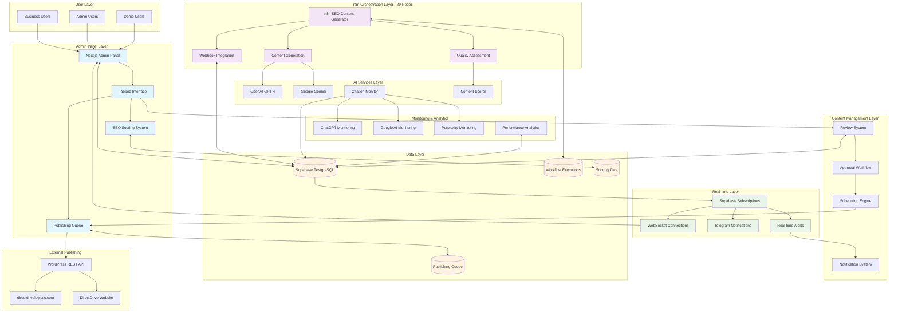
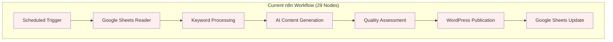
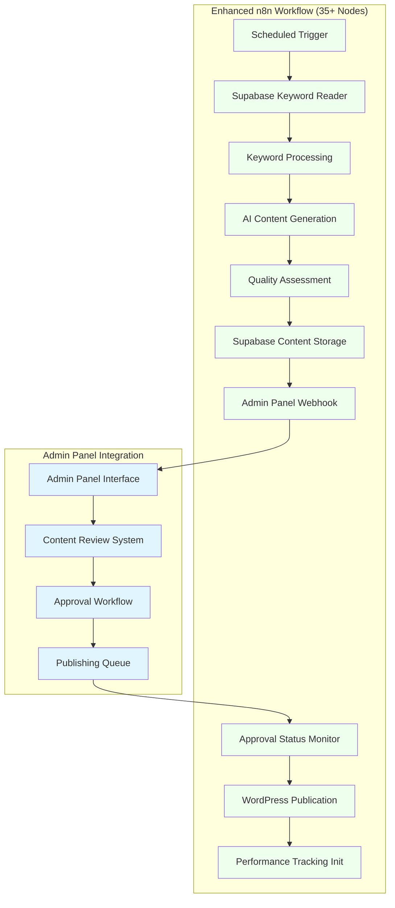

# High Level Architecture

## Technical Summary

DirectDrive Authority Engine employs a **hybrid automation-first architecture** with **admin-panel-driven content management** combining n8n workflow orchestration (29-node SEO Content Generator) with modern cloud infrastructure for AI-powered content generation and review. The system features a **Next.js tabbed admin interface** (Article|Images|SEO|Links|Preview) with **real-time SEO scoring** (87/100 visual format) and **five-state content workflow** (generated → under_review → approved → scheduled → published). **Supabase PostgreSQL backend** provides real-time subscriptions for **WebSocket-driven updates** and **Telegram notifications**, while maintaining **sub-2s response times** for admin panel interactions. **Flexible publishing queue** enables **business event-aligned scheduling** with **concurrent review handling** across multiple admin users. The **n8n workflow integration** preserves existing content generation logic while adding **webhook-driven admin panel updates** and **quality assessment scoring**. This enhanced architecture supports **team-based content operations** with **performance-first design** and **real-time collaboration capabilities**.

## Platform and Infrastructure Choice

**Platform:** Vercel + Supabase + n8n Cloud
**Key Services:** 
- Vercel (Frontend hosting, Edge functions)
- Supabase (PostgreSQL, Real-time, Auth)
- n8n Cloud (Workflow orchestration)
- Content Crawler (Website verification service)
- External APIs (OpenAI, Google AI, WordPress)
**Deployment Host and Regions:** 
- Vercel Edge Network (global CDN)
- Supabase EU-West (closest to Kurdistan/MENA)

**Platform Selection Rationale:**
Chosen Vercel + Supabase over AWS for faster development iteration while maintaining enterprise-grade capabilities. This combination provides seamless Next.js deployment, real-time database capabilities, and generous free tiers that align with the BUILD → PROVE → SELL strategy.

## Repository Structure

**Structure:** Monorepo with npm workspaces
**Monorepo Tool:** npm workspaces (simplicity over complexity)
**Package Organization:** 
- `apps/dashboard` - Next.js admin panel with tabbed interface and real-time features
- `apps/n8n-workflows` - Enhanced n8n workflow definitions with webhook integration
- `packages/shared` - TypeScript interfaces for content states and scoring system
- `packages/ai-clients` - AI model integration utilities with scoring capabilities
- `packages/database` - Supabase client, schema, and real-time subscriptions
- `packages/content-crawler` - Website verification and monitoring service
- `packages/notification-system` - Telegram and in-app notification handlers
- `packages/publishing-queue` - Queue management and scheduling engine
- `packages/scoring-engine` - Real-time SEO scoring and analysis system

## Enhanced System Architecture Diagram



## Enhanced Architectural Patterns

### Core Patterns
- **Admin-Panel-First Architecture:** Next.js tabbed interface (Article|Images|SEO|Links|Preview) with real-time scoring system - *Rationale:* Provides immediate content quality feedback and streamlined review workflow
- **Content State Management:** Five-state workflow (generated → under_review → approved → scheduled → published) with transition controls - *Rationale:* Ensures content quality and publication timing alignment
- **n8n Workflow Integration:** Maintains existing 29-node workflow while adding admin panel integration points - *Rationale:* Preserves proven content generation logic while adding review capabilities
- **Real-time Scoring Architecture:** Live SEO scoring with visual breakdown (87/100 format) and component-level feedback - *Rationale:* Enables immediate content optimization during review process

### Publishing & Queue Patterns
- **Flexible Publishing Queue:** Business event-aligned scheduling with concurrent review handling - *Rationale:* Supports strategic publication timing while preventing content conflicts
- **Dual Notification System:** In-app notifications + Telegram integration for distributed team management - *Rationale:* Ensures team coordination across different communication preferences
- **Performance-First Design:** Sub-2s admin panel response times through optimized API layer - *Rationale:* Maintains user experience during high-volume content review sessions

### Enhanced Integration Patterns
- **Webhook-Driven Updates:** n8n workflow completion triggers admin panel updates via Supabase webhooks - *Rationale:* Maintains loose coupling while ensuring real-time content availability
- **Content-Citation-Performance Loop:** Automated correlation between published content and AI citation improvements with 12-week attribution tracking - *Rationale:* Provides quantifiable ROI measurement for content strategy optimization
- **Multi-Factor Verification System:** Content matching through URL tracking, title+date correlation, keyword fingerprinting, and content similarity analysis - *Rationale:* Ensures >85% confidence in content-citation correlation accuracy
- **Event-Driven Real-time Updates:** Supabase subscriptions trigger WebSocket updates to admin panel and Telegram notifications - *Rationale:* Provides immediate feedback on content status changes and citation improvements

### Scalability & Performance Patterns
- **Concurrent Review Architecture:** Multiple admin users can review different content pieces simultaneously without conflicts - *Rationale:* Supports team-based content operations with proper state isolation
- **Scheduled Execution Preservation:** Maintains Sun/Wed 8 AM execution schedule while adding on-demand content generation - *Rationale:* Balances automated operations with responsive content needs
- **API Layer Optimization:** Dedicated admin panel endpoints with <2s response times and real-time updates - *Rationale:* Ensures responsive user experience during content review and approval workflows

## Admin Panel Technical Architecture

### Component Structure
```
Admin Panel (/apps/dashboard)
├── Content Review Interface
│   ├── Article Tab (title, content, meta)
│   ├── Images Tab (featured, gallery, alt text)
│   ├── SEO Tab (scoring, keywords, optimization)
│   ├── Links Tab (internal, external, anchor text)
│   └── Preview Tab (final render, mobile/desktop)
├── Publishing Queue Management
│   ├── Scheduling Interface
│   ├── Business Event Alignment
│   └── Bulk Operations
├── Real-time Notifications
│   ├── In-app Alert System
│   ├── Telegram Integration
│   └── Status Change Tracking
└── Performance Dashboard
    ├── Content Effectiveness Metrics
    ├── SEO Score Analytics
    └── ROI Correlation Display
```

### n8n Workflow Integration Points

#### Existing 29-Node Workflow Enhancements
1. **Google Sheets → Supabase Migration**: Replace Google Sheets nodes with Supabase database operations
2. **Content State Management**: Implement five-state workflow (generated → under_review → approved → scheduled → published)
3. **Admin Panel Integration**: Add webhook nodes for real-time admin panel notifications
4. **Quality Assessment Enhancement**: Integrate real-time SEO scoring and content quality metrics

#### Critical Migration Requirements
1. **Preserve Execution Schedule**: Maintain Sun/Wed 8 AM automated execution
2. **Content Generation Logic**: Keep existing 29-node AI content generation flow
3. **Language Model Routing**: Preserve GPT-4 (EN/AR) and Gemini (KU/FA) model selection
4. **Error Handling**: Maintain robust error handling and retry mechanisms

#### New Admin Panel Integration Workflows
1. **Content Completion Webhook**: n8n → Admin Panel notification of new content ready for review
2. **Approval Processing**: Admin approval → n8n publishing queue trigger
3. **Real-time Status Updates**: Bidirectional status synchronization between n8n and admin panel
4. **Performance Tracking Integration**: Content publication → performance monitoring activation

### Real-time System Architecture

#### Supabase Real-time Subscriptions
```sql
-- Content status changes
SUBSCRIBE TO changes ON content_pieces 
WHERE status IN ('under_review', 'approved', 'scheduled', 'published')

-- SEO score updates
SUBSCRIBE TO changes ON content_scoring 
WHERE score_updated_at > NOW() - INTERVAL '5 minutes'

-- Publishing queue changes
SUBSCRIBE TO changes ON publishing_queue 
WHERE status IN ('pending', 'processing', 'completed', 'failed')
```

#### WebSocket Event Types
- `content_status_changed`: Content moved between workflow states
- `seo_score_updated`: Real-time scoring system updates
- `queue_status_changed`: Publishing queue state transitions
- `review_assigned`: Content assigned to specific reviewer
- `approval_required`: Content ready for final approval

### Performance Requirements Implementation

#### Sub-2 Second Response Times
1. **Database Optimization**: Indexed queries on content status and reviewer assignments
2. **API Layer Caching**: Redis-based caching for frequently accessed content metadata
3. **Real-time Updates**: WebSocket connections eliminate polling overhead
4. **Concurrent Handling**: Row-level locking prevents review conflicts

#### Scalability Architecture
1. **Horizontal Scaling**: Stateless API design supports multiple admin panel instances
2. **Queue Management**: Background job processing for heavy operations
3. **Real-time Optimization**: Connection pooling for WebSocket scalability
4. **Data Partitioning**: Content state-based table partitioning for performance

## n8n to Supabase Migration Architecture

### Current State Analysis


### Target State Architecture


### Migration Implementation Strategy

#### Phase 1: Database Integration (Week 1)
1. **Replace Google Sheets Nodes**: Swap Google Sheets reader/writer with Supabase operations
2. **Content State Management**: Implement content_pieces table with workflow states
3. **Preserve Execution Logic**: Maintain exact same keyword processing and AI generation flow
4. **Error Handling**: Ensure robust error handling during database operations

#### Phase 2: Admin Panel Integration (Week 2)
1. **Webhook Implementation**: Add webhook nodes to notify admin panel of content completion
2. **Status Synchronization**: Implement bidirectional status updates between n8n and admin panel
3. **Approval Workflow**: Add approval monitoring nodes that wait for admin approval before publication
4. **Queue Processing**: Integrate with admin panel publishing queue system

#### Phase 3: Performance Enhancement (Week 3)
1. **Real-time Scoring**: Integrate SEO scoring engine with content quality assessment
2. **Performance Tracking**: Initialize content performance monitoring upon publication
3. **Notification System**: Implement Telegram notifications for content status changes
4. **Concurrent Processing**: Optimize for multiple admin users reviewing content simultaneously

### Technical Implementation Details

#### Supabase Integration Nodes
```yaml
Node Configuration:
  Supabase Keyword Reader:
    Query: "SELECT * FROM keywords WHERE processing_status = 'pending' ORDER BY priority_level DESC LIMIT 10"
    Method: HTTP Request to Supabase REST API
    Authentication: Bearer token with service role key
    
  Supabase Content Writer:
    Table: content_pieces
    Fields: keyword_id, title, content_body, ai_model_used, quality_score, content_status
    Method: POST to Supabase REST API
    Status: Set to 'under_review' for admin panel processing
    
  Supabase Status Monitor:
    Query: "SELECT content_status FROM content_pieces WHERE id = {{content_id}}"
    Polling: Check every 30 seconds for status change to 'approved'
    Timeout: 24 hours before marking as 'timeout_approval'
```

#### Admin Panel Webhook Integration
```yaml
Webhook Configuration:
  Content Completion Webhook:
    URL: https://directdrive-authority.vercel.app/api/v1/webhooks/n8n/content-complete
    Method: POST
    Payload:
      workflow_id: "VVAuXhF9yGXIGqjy"
      content_data:
        content_id: number
        title: string
        quality_score: number
        seo_score: number
      generation_metadata:
        ai_model: string
        generation_time: number
        keyword_data: object
        
  Publication Status Webhook:
    URL: https://directdrive-authority.vercel.app/api/v1/webhooks/n8n/publish-complete
    Method: POST
    Payload:
      content_id: number
      publication_url: string
      publication_status: "success" | "failed"
```

#### Performance Optimization Strategy

##### Database Performance
1. **Connection Pooling**: Use persistent connections to Supabase for reduced latency
2. **Indexed Queries**: Leverage database indexes for fast keyword and content lookups
3. **Batch Operations**: Process multiple keywords in parallel while respecting rate limits
4. **Error Recovery**: Implement exponential backoff for database connection failures

##### Real-time Updates
1. **WebSocket Integration**: Use Supabase real-time subscriptions for instant admin panel updates
2. **Event-Driven Architecture**: Trigger admin panel updates only when content status changes
3. **Connection Management**: Maintain persistent WebSocket connections for sub-second response times
4. **Scalability**: Support multiple concurrent admin users without performance degradation

##### Concurrent Review Handling
1. **Row-Level Locking**: Use database locks to prevent content review conflicts
2. **Assignment System**: Automatic reviewer assignment based on workload and availability
3. **State Isolation**: Ensure reviewer actions don't interfere with each other
4. **Conflict Resolution**: Handle simultaneous approval attempts gracefully

### Success Metrics and Monitoring

#### Migration Success Criteria
1. **Zero Downtime**: Migration completed without interrupting scheduled content generation
2. **Performance Improvement**: <2s admin panel response times achieved
3. **Data Integrity**: 100% content data preserved during migration
4. **Workflow Reliability**: 99%+ success rate for automated content generation

#### Performance Monitoring
1. **n8n Execution Metrics**: Track workflow execution time and success rates
2. **Database Performance**: Monitor query response times and connection health
3. **Admin Panel Metrics**: Track user interaction response times and error rates
4. **Real-time Update Latency**: Measure WebSocket event delivery times

---
