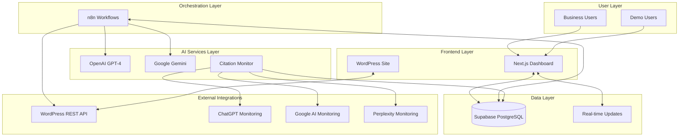

# High Level Architecture

## Technical Summary

DirectDrive Authority Engine employs a **hybrid automation-first architecture** combining n8n workflow orchestration with modern cloud infrastructure for AI-powered content generation and citation monitoring. The system uses **Next.js frontend** with **Supabase PostgreSQL backend** for data management, integrated with **multi-language AI models** (GPT-4, Gemini) for cultural content adaptation. **WordPress REST API integration** enables automated publishing to directdrivelogistic.com, while **real-time citation monitoring** tracks AI model mentions across ChatGPT, Google AI, and Perplexity. This modular architecture supports DirectDrive logistics validation before tourism industry scaling through **industry-agnostic database design** and **configurable content templates**.

## Platform and Infrastructure Choice

**Platform:** Vercel + Supabase + n8n Cloud
**Key Services:** 
- Vercel (Frontend hosting, Edge functions)
- Supabase (PostgreSQL, Real-time, Auth)
- n8n Cloud (Workflow orchestration)
- External APIs (OpenAI, Google AI, WordPress)
**Deployment Host and Regions:** 
- Vercel Edge Network (global CDN)
- Supabase EU-West (closest to Kurdistan/MENA)

**Platform Selection Rationale:**
Chosen Vercel + Supabase over AWS for faster development iteration while maintaining enterprise-grade capabilities. This combination provides seamless Next.js deployment, real-time database capabilities, and generous free tiers that align with the BUILD → PROVE → SELL strategy.

## Repository Structure

**Structure:** Monorepo with npm workspaces
**Monorepo Tool:** npm workspaces (simplicity over complexity)
**Package Organization:** 
- `apps/dashboard` - Next.js frontend dashboard
- `apps/n8n-workflows` - n8n workflow definitions
- `packages/shared` - TypeScript interfaces for data models
- `packages/ai-clients` - AI model integration utilities
- `packages/database` - Supabase client and schema

## High Level Architecture Diagram

## Architectural Patterns

- **Workflow-Driven Architecture:** n8n orchestration manages all content generation and monitoring flows - *Rationale:* Maintains visual workflow management while adding enterprise data capabilities
- **Multi-Tenant Data Design:** Industry-agnostic database schema supporting logistics and tourism modules - *Rationale:* Enables rapid industry switching without technical debt
- **Event-Driven Citations:** Real-time Supabase updates trigger dashboard notifications - *Rationale:* Immediate feedback on AI citation improvements for business validation
- **AI Model Routing:** Language-based model selection for cultural content optimization - *Rationale:* Maximizes content quality across English, Arabic, Kurdish, Farsi markets
- **Modular Industry Framework:** Configuration-driven content templates and keywords - *Rationale:* Supports BUILD → PROVE → SELL strategy with reusable architecture

---
