# n8n Workflow Migration Plan
*DirectDrive Authority Engine - Google Sheets to Supabase Migration*

## Executive Summary

This document outlines the comprehensive migration plan for transitioning the existing 29-node n8n SEO Content Generator workflow from Google Sheets dependency to Supabase database integration, while adding admin panel workflow integration and maintaining zero downtime.

**Migration Objectives:**
- Replace Google Sheets nodes with Supabase database operations
- Implement five-state content workflow (generated → under_review → approved → scheduled → published)
- Add admin panel integration with real-time updates
- Preserve existing content generation logic and scheduling
- Maintain 99%+ workflow reliability during transition

## Current State Analysis

### Existing Workflow Architecture (VVAuXhF9yGXIGqjy)

```mermaid
graph TB
    subgraph "Current 29-Node Workflow"
        START[Cron Trigger: Sun/Wed 8 AM]
        SHEETS_READ[Google Sheets: Read Keywords]
        FILTER[Filter Pending Keywords]
        LOOP_START[Loop: For Each Keyword]
        
        subgraph "Content Generation Loop"
            LANG_ROUTE[Language Router]
            GPT4_EN[GPT-4: English Content]
            GPT4_AR[GPT-4: Arabic Content]
            GEMINI_KU[Gemini: Kurdish Content]
            GEMINI_FA[Gemini: Farsi Content]
            QUALITY_CHECK[Quality Assessment]
            TITLE_GEN[Title Generation]
            META_GEN[Meta Description]
            IMAGE_SEL[Image Selection]
        end
        
        WP_PUBLISH[WordPress Publication]
        SHEETS_UPDATE[Google Sheets: Update Status]
        TELEGRAM_NOTIFY[Telegram Notification]
        LOOP_END[End Loop]
        COMPLETION[Workflow Complete]
    end
    
    START --> SHEETS_READ
    SHEETS_READ --> FILTER
    FILTER --> LOOP_START
    LOOP_START --> LANG_ROUTE
    LANG_ROUTE --> GPT4_EN
    LANG_ROUTE --> GPT4_AR
    LANG_ROUTE --> GEMINI_KU
    LANG_ROUTE --> GEMINI_FA
    GPT4_EN --> QUALITY_CHECK
    GPT4_AR --> QUALITY_CHECK
    GEMINI_KU --> QUALITY_CHECK
    GEMINI_FA --> QUALITY_CHECK
    QUALITY_CHECK --> TITLE_GEN
    TITLE_GEN --> META_GEN
    META_GEN --> IMAGE_SEL
    IMAGE_SEL --> WP_PUBLISH
    WP_PUBLISH --> SHEETS_UPDATE
    SHEETS_UPDATE --> TELEGRAM_NOTIFY
    TELEGRAM_NOTIFY --> LOOP_END
    LOOP_END --> COMPLETION
    
    classDef current fill:#ffeeee
    class START,SHEETS_READ,FILTER,LOOP_START,LANG_ROUTE,GPT4_EN,GPT4_AR,GEMINI_KU,GEMINI_FA,QUALITY_CHECK,TITLE_GEN,META_GEN,IMAGE_SEL,WP_PUBLISH,SHEETS_UPDATE,TELEGRAM_NOTIFY,LOOP_END,COMPLETION current
```



### Current Dependencies and Integration Points

#### Google Sheets Integration
- **Keywords Sheet**: Source of truth for content generation targets
- **Status Tracking**: Updates processing status and publication URLs
- **Performance Metrics**: Basic statistics on content generation
- **Manual Intervention**: Human review through sheet edits

#### Critical Success Factors
- **Scheduled Execution**: Reliable Sun/Wed 8 AM execution (Kurdistan time)
- **Language Model Routing**: Accurate routing based on keyword language
- **Error Handling**: Robust retry mechanisms for API failures
- **Quality Assessment**: Consistent content quality scoring
- **WordPress Integration**: Seamless publication to directdrivelogistic.com

## Target State Architecture

### Enhanced Workflow with Admin Panel Integration

```mermaid
graph TB
    subgraph "Enhanced 35+ Node Workflow"
        START[Cron Trigger: Sun/Wed 8 AM]
        SB_READ[Supabase: Read Pending Keywords]
        PRIORITY_SORT[Sort by Priority Level]
        LOOP_START[Loop: For Each Keyword]
        
        subgraph "Enhanced Content Generation"
            SB_LOCK[Database: Lock Keyword]
            LANG_ROUTE[Language Router]
            GPT4_EN[GPT-4: English Content]
            GPT4_AR[GPT-4: Arabic Content]
            GEMINI_KU[Gemini: Kurdish Content]
            GEMINI_FA[Gemini: Farsi Content]
            ENHANCED_QA[Enhanced Quality Assessment]
            SEO_SCORE[Real-time SEO Scoring]
            TITLE_GEN[Title Generation]
            META_GEN[Meta Description]
            IMAGE_SEL[Image Selection]
        end
        
        SB_STORE[Supabase: Store Content]
        STATUS_UPDATE[Update Status: under_review]
        ADMIN_WEBHOOK[Webhook: Notify Admin Panel]
        
        subgraph "Admin Panel Integration"
            ADMIN_NOTIFICATION[Admin Panel: New Content Alert]
            APPROVAL_WAIT[Wait for Admin Approval]
            APPROVAL_CHECK[Check Approval Status]
        end
        
        QUEUE_INSERT[Publishing Queue: Add Item]
        QUEUE_PROCESS[Queue Processor]
        WP_PUBLISH[WordPress Publication]
        PERF_INIT[Initialize Performance Tracking]
        SB_FINAL_UPDATE[Supabase: Update Published Status]
        TELEGRAM_NOTIFY[Telegram Notification]
        LOOP_END[End Loop]
        COMPLETION[Workflow Complete]
    end
    
    START --> SB_READ
    SB_READ --> PRIORITY_SORT
    PRIORITY_SORT --> LOOP_START
    LOOP_START --> SB_LOCK
    SB_LOCK --> LANG_ROUTE
    LANG_ROUTE --> GPT4_EN
    LANG_ROUTE --> GPT4_AR
    LANG_ROUTE --> GEMINI_KU
    LANG_ROUTE --> GEMINI_FA
    GPT4_EN --> ENHANCED_QA
    GPT4_AR --> ENHANCED_QA
    GEMINI_KU --> ENHANCED_QA
    GEMINI_FA --> ENHANCED_QA
    ENHANCED_QA --> SEO_SCORE
    SEO_SCORE --> TITLE_GEN
    TITLE_GEN --> META_GEN
    META_GEN --> IMAGE_SEL
    IMAGE_SEL --> SB_STORE
    SB_STORE --> STATUS_UPDATE
    STATUS_UPDATE --> ADMIN_WEBHOOK
    ADMIN_WEBHOOK --> ADMIN_NOTIFICATION
    ADMIN_NOTIFICATION --> APPROVAL_WAIT
    APPROVAL_WAIT --> APPROVAL_CHECK
    APPROVAL_CHECK --> QUEUE_INSERT
    QUEUE_INSERT --> QUEUE_PROCESS
    QUEUE_PROCESS --> WP_PUBLISH
    WP_PUBLISH --> PERF_INIT
    PERF_INIT --> SB_FINAL_UPDATE
    SB_FINAL_UPDATE --> TELEGRAM_NOTIFY
    TELEGRAM_NOTIFY --> LOOP_END
    LOOP_END --> COMPLETION
    
    classDef enhanced fill:#eeffee
    classDef admin fill:#e1f5fe
    classDef new fill:#fff3e0
    class START,SB_READ,PRIORITY_SORT,LOOP_START,SB_LOCK,LANG_ROUTE,GPT4_EN,GPT4_AR,GEMINI_KU,GEMINI_FA,ENHANCED_QA,SEO_SCORE,TITLE_GEN,META_GEN,IMAGE_SEL,SB_STORE,STATUS_UPDATE,QUEUE_INSERT,QUEUE_PROCESS,WP_PUBLISH,SB_FINAL_UPDATE,TELEGRAM_NOTIFY,LOOP_END,COMPLETION enhanced
    class ADMIN_WEBHOOK,ADMIN_NOTIFICATION,APPROVAL_WAIT,APPROVAL_CHECK admin
    class PERF_INIT new
```



## Migration Implementation Plan

### Phase 1: Foundation Setup (Days 1-3)

#### Day 1: Database Schema Preparation
```bash
# Verify Supabase schema alignment
psql -h lrwdoihyhnybwwntmmrs.supabase.co -U postgres -d postgres

# Run schema validation
\i /database/story_1_5_enhanced_schema.sql

# Verify indexes and constraints
SELECT indexname, indexdef FROM pg_indexes WHERE tablename IN ('keywords', 'content_pieces');
```

#### Day 2: n8n Environment Setup
- Create development copy of existing workflow
- Set up Supabase credentials in n8n environment variables
- Test basic connectivity between n8n and Supabase
- Configure webhook endpoints for admin panel integration

#### Day 3: Data Migration Preparation
- Export current Google Sheets data
- Create data migration scripts
- Validate data integrity and completeness
- Set up rollback procedures

### Phase 2: Core Node Migration (Days 4-7)

#### Node-by-Node Migration Strategy

##### Keyword Reading Node Migration
```yaml
Old Node: Google Sheets Reader
  Configuration:
    Spreadsheet ID: [existing-sheet-id]
    Range: "Keywords!A:F"
    
New Node: Supabase Query
  Configuration:
    Operation: "Select"
    Table: "keywords"
    Query: |
      SELECT keyword_id, industry_category, language, keyword_text, 
             secondary_keywords, intent, region, priority_level
      FROM keywords 
      WHERE processing_status = 'pending' 
      ORDER BY priority_level DESC, created_at ASC
      LIMIT 10
    Authentication: Service Role Key
```

##### Content Storage Node Migration
```yaml
Old Node: Google Sheets Writer
  Configuration:
    Operation: "Append"
    Range: "Generated_Content!A:H"
    
New Node: Supabase Insert
  Configuration:
    Operation: "Insert"
    Table: "content_pieces"
    Fields:
      keyword_id: "{{ $node['Keyword Processing'].json.keyword_id }}"
      title: "{{ $node['Title Generation'].json.title }}"
      content_body: "{{ $node['Content Generation'].json.content }}"
      industry_category: "{{ $node['Keyword Processing'].json.industry_category }}"
      language: "{{ $node['Keyword Processing'].json.language }}"
      ai_model_used: "{{ $node['Language Router'].json.selected_model }}"
      quality_score: "{{ $node['Quality Assessment'].json.score }}"
      content_status: "under_review"
      workflow_state: "pending_review"
```

##### Status Update Node Migration
```yaml
Old Node: Google Sheets Update
  Configuration:
    Operation: "Update"
    
New Node: Supabase Update
  Configuration:
    Operation: "Update"
    Table: "keywords"
    Where Condition: "keyword_id = {{ $node['Keyword Processing'].json.keyword_id }}"
    Fields:
      processing_status: "completed"
      last_processed_at: "{{ new Date().toISOString() }}"
```

### Phase 3: Admin Panel Integration (Days 8-10)

#### Admin Panel Webhook Integration
```yaml
New Node: Admin Panel Webhook
  Configuration:
    HTTP Method: POST
    URL: "https://directdrive-authority.vercel.app/api/v1/webhooks/n8n/content-complete"
    Headers:
      Content-Type: "application/json"
      Authorization: "Bearer {{ $env.ADMIN_PANEL_API_KEY }}"
    Body:
      workflow_id: "VVAuXhF9yGXIGqjy"
      execution_id: "{{ $workflow.id }}"
      content_data:
        content_id: "{{ $node['Content Storage'].json.content_piece_id }}"
        title: "{{ $node['Title Generation'].json.title }}"
        quality_score: "{{ $node['Quality Assessment'].json.score }}"
        seo_score: "{{ $node['SEO Scoring'].json.overall_score }}"
      generation_metadata:
        ai_model: "{{ $node['Language Router'].json.selected_model }}"
        generation_time: "{{ $node['Content Generation'].json.processing_time }}"
        keyword_data: "{{ $node['Keyword Processing'].json }}"
```

#### Approval Monitoring Node
```yaml
New Node: Approval Status Monitor
  Configuration:
    Operation: "Polling"
    Interval: 30 seconds
    Max Attempts: 2880 (24 hours)
    Query: |
      SELECT content_status, workflow_state, scheduled_publish_date
      FROM content_pieces 
      WHERE content_piece_id = {{ $node['Content Storage'].json.content_piece_id }}
    Success Condition: "content_status = 'approved'"
    Timeout Action: "Update status to 'timeout_approval'"
```

### Phase 4: Enhanced Features (Days 11-14)

#### Real-time SEO Scoring Integration
```yaml
New Node: SEO Scoring Engine
  Configuration:
    Function: |
      const content = $node['Content Generation'].json.content;
      const title = $node['Title Generation'].json.title;
      const keywords = $node['Keyword Processing'].json;
      
      // Calculate SEO components
      const keywordDensity = calculateKeywordDensity(content, keywords.keyword_text);
      const readabilityScore = calculateReadability(content);
      const structureScore = analyzeContentStructure(content);
      
      const seoScore = {
        overall_score: Math.round((keywordDensity + readabilityScore + structureScore) / 3),
        breakdown: {
          content_quality: analyzeContentQuality(content),
          seo_optimization: keywordDensity,
          readability: readabilityScore,
          keyword_density: keywordDensity,
          structure_quality: structureScore
        }
      };
      
      return seoScore;
```

#### Performance Tracking Initialization
```yaml
New Node: Performance Tracking Init
  Configuration:
    Operation: "Insert"
    Table: "content_performance"
    Fields:
      content_id: "{{ $node['Content Storage'].json.content_piece_id }}"
      verification_status: "pending"
      attribution_phase: "baseline"
      citation_baseline_count: 0
      citation_current_count: 0
      tracking_start_date: "{{ new Date().toISOString() }}"
    Condition: "Only if content_status = 'published'"
```

### Phase 5: Testing and Optimization (Days 15-17)

#### Comprehensive Testing Strategy

##### Unit Testing
- Individual node functionality testing
- Database connection reliability testing
- Error handling scenario testing
- Performance benchmarking

##### Integration Testing
```yaml
Test Scenarios:
  1. End-to-End Workflow Execution:
     - Trigger: Manual execution
     - Expected: Complete workflow execution with database updates
     - Validation: Check all database records created correctly
     
  2. Admin Panel Integration:
     - Trigger: Content completion webhook
     - Expected: Admin panel receives notification
     - Validation: Real-time UI update occurs
     
  3. Approval Workflow:
     - Trigger: Admin approves content in panel
     - Expected: n8n continues to publication
     - Validation: WordPress publication occurs
     
  4. Error Recovery:
     - Trigger: Simulate API failures
     - Expected: Retry mechanisms activate
     - Validation: Eventual success or proper error logging
```

##### Performance Testing
```bash
# Database performance testing
time psql -h lrwdoihyhnybwwntmmrs.supabase.co -U postgres -d postgres -c "
SELECT * FROM keywords WHERE processing_status = 'pending' 
ORDER BY priority_level DESC LIMIT 10"

# Expected: < 200ms response time

# Webhook endpoint testing
curl -X POST https://directdrive-authority.vercel.app/api/v1/webhooks/n8n/content-complete \
  -H "Content-Type: application/json" \
  -d '{"test": "performance"}' \
  -w "Total time: %{time_total}s\n"

# Expected: < 500ms response time
```

### Phase 6: Production Deployment (Days 18-21)

#### Deployment Strategy

##### Blue-Green Deployment Approach
1. **Blue Environment (Current)**: Existing Google Sheets workflow
2. **Green Environment (New)**: Enhanced Supabase workflow
3. **Traffic Switching**: Gradual migration with rollback capability

##### Migration Execution Plan
```yaml
Day 18: Parallel Execution Setup
  - Deploy green environment alongside blue
  - Run both workflows in parallel for comparison
  - Validate output consistency
  
Day 19: Data Validation
  - Compare generated content quality
  - Verify database integrity
  - Test admin panel integration
  
Day 20: Production Switch
  - Disable blue environment scheduled trigger
  - Enable green environment scheduled trigger
  - Monitor first production execution
  
Day 21: Validation and Cleanup
  - Confirm successful production execution
  - Archive Google Sheets workflow
  - Update documentation
```

## Risk Mitigation Strategies

### Critical Risk Factors

#### 1. Workflow Execution Failure
**Risk**: New workflow fails during scheduled execution
**Mitigation**:
- Comprehensive testing in development environment
- Parallel execution for validation period
- Immediate rollback capability to Google Sheets workflow
- Real-time monitoring and alerting

#### 2. Data Loss or Corruption
**Risk**: Content data lost during migration
**Mitigation**:
- Complete backup of existing Google Sheets data
- Transaction-based database operations
- Data validation checksums
- Recovery procedures documented

#### 3. Admin Panel Integration Issues
**Risk**: Admin panel doesn't receive workflow updates
**Mitigation**:
- Webhook endpoint health monitoring
- Fallback notification mechanisms
- Manual approval override procedures
- Comprehensive error logging

#### 4. Performance Degradation
**Risk**: New workflow slower than existing system
**Mitigation**:
- Database query optimization
- Connection pooling implementation
- Performance benchmarking throughout development
- Resource scaling plans

### Rollback Procedures

#### Emergency Rollback to Google Sheets
```yaml
Rollback Steps:
  1. Disable Supabase workflow trigger
  2. Re-enable Google Sheets workflow trigger
  3. Sync any pending content back to sheets
  4. Notify team of rollback execution
  5. Debug Supabase integration issues

Rollback Time: < 15 minutes
Data Loss: Minimal (any in-flight executions only)
```

## Success Metrics and Monitoring

### Key Performance Indicators (KPIs)

#### Technical Metrics
- **Workflow Execution Time**: Target <15 minutes (current: ~12 minutes)
- **Database Response Time**: Target <200ms for keyword queries
- **Admin Panel Update Latency**: Target <2 seconds
- **Workflow Success Rate**: Target >99.5%

#### Operational Metrics
- **Content Generation Volume**: Maintain current 10-15 pieces per execution
- **Content Quality Score**: Maintain >85 average quality score
- **Admin Review Time**: Target <2 hours average review time
- **Publication Success Rate**: Target >98%

### Monitoring Implementation

#### Real-time Monitoring Dashboard
```yaml
Metrics Dashboard:
  Workflow Execution Status:
    - Current execution progress
    - Recent execution history
    - Error rate trends
    - Performance metrics
    
  Database Health:
    - Connection status
    - Query performance
    - Storage utilization
    - Error logs
    
  Admin Panel Integration:
    - Webhook delivery status
    - Review queue backlog
    - Approval processing time
    - User activity metrics
```

#### Alerting Strategy
```yaml
Critical Alerts:
  - Workflow execution failure
  - Database connection issues
  - Admin panel webhook failures
  - Content publication failures
  
Warning Alerts:
  - Slower than expected execution times
  - High review queue backlog
  - Content quality score drops
  - Database performance degradation
```

## Post-Migration Optimization

### Continuous Improvement Areas

#### 1. Workflow Performance Optimization
- Parallel content generation for multiple keywords
- Caching frequently accessed data
- Optimizing AI model API calls
- Database query optimization

#### 2. Admin Panel Feature Enhancement
- Advanced content filtering and search
- Bulk approval operations
- Content scheduling optimization
- Performance analytics integration

#### 3. Content Quality Improvements
- Enhanced SEO scoring algorithms
- Real-time content optimization suggestions
- Automated content improvement recommendations
- A/B testing for content variations

### Future Roadmap

#### Short-term (Months 1-3)
- Mobile-responsive admin panel
- Advanced content analytics
- Automated content scheduling
- Enhanced error reporting

#### Medium-term (Months 4-6)
- Multi-language content optimization
- AI-powered content suggestions
- Advanced workflow automation
- Content performance correlation analysis

#### Long-term (Months 7-12)
- Machine learning content optimization
- Predictive content performance
- Advanced citation correlation
- Multi-client content management

---

**Migration Success Criteria:**
✅ Zero downtime during migration
✅ 100% data integrity preservation
✅ Admin panel integration functional
✅ <2s response times achieved
✅ Workflow reliability >99%
✅ Content quality maintained or improved

This migration plan provides a comprehensive roadmap for transitioning from Google Sheets to Supabase while enhancing the workflow with admin panel integration and real-time capabilities.