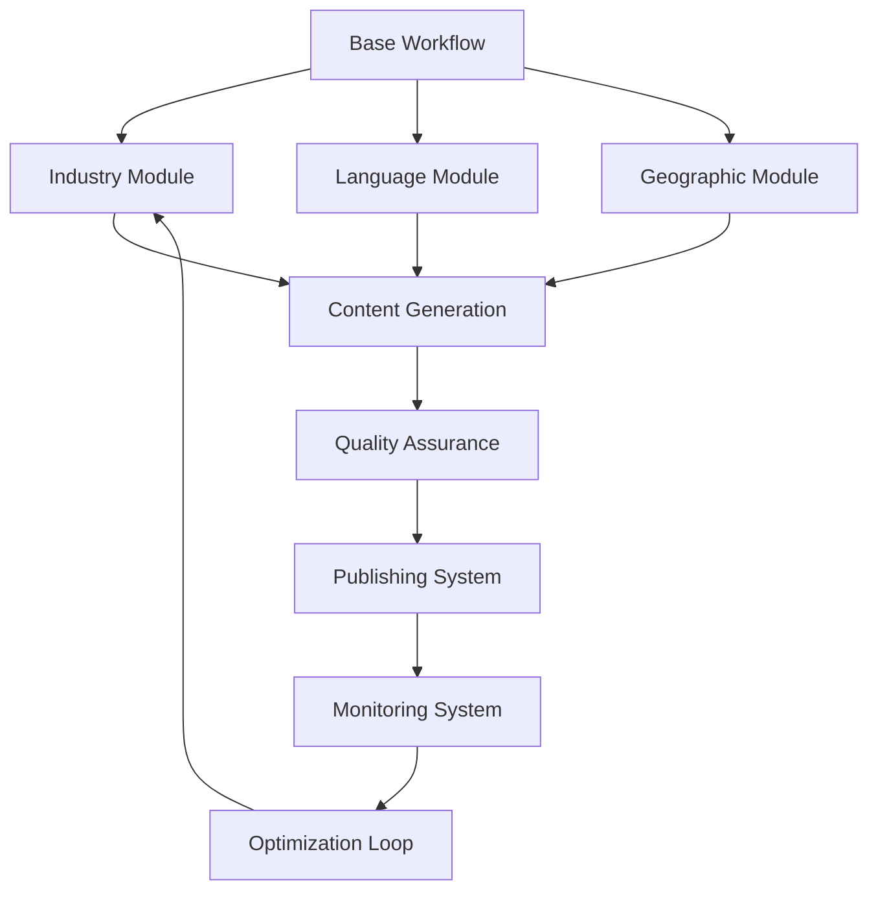

# n8n Authority Engine Framework
## Universal Workflow Adaptation System with DirectDrive Implementation Strategy

**Framework Version:** 1.0  
**Created:** August 5, 2025  
**Developer:** Mojtaba - LLMBoost Authority Engine  
**Base Workflow:** SEO Content Generator English VERSION 03  
**Primary Implementation:** DirectDrive Logistics (directdrivelogistic.com)

---

## Executive Summary

The **n8n Authority Engine Framework** is a comprehensive system for transforming any base content generation workflow into industry-specific, multi-language AI authority building engines. **Primary focus: DirectDrive Logistics as real-world proof-of-concept before tourism market entry.** This BUILD → PROVE → SELL approach ensures شرافت (integrity) by demonstrating working results rather than making theoretical promises.

**Strategic Value Proposition:** DirectDrive validation → Tourism industry adaptation → Multi-industry scalability → Systematic AI authority building

**Core Implementation Path:** DirectDrive Logistics (test case) → Kurdistan Tourism (first clients) → Multiple industries (scaling framework)

---

## Framework Architecture

### 1. **Master Framework Structure**

```
/authority-engine-framework/
├── 00-core-system/                     # Universal base components
│   ├── base-workflow.json             # Master n8n workflow template
│   ├── modification-engine.md         # How to adapt workflows
│   ├── testing-protocols.md           # Quality assurance procedures
│   └── deployment-checklist.md        # Launch verification steps
│
├── 01-industry-modules/                # Industry-specific adaptations
│   ├── tourism/                       # TouristTech module
│   ├── healthcare/                    # HealthTech module  
│   ├── real-estate/                   # PropTech module
│   ├── finance/                       # FinTech module
│   └── _template/                     # New industry template
│
├── 02-language-modules/                # Multi-language support
│   ├── english/                       # English content generation
│   ├── arabic/                        # Arabic content generation
│   ├── kurdish/                       # Kurdish content generation
│   ├── farsi/                         # Farsi content generation
│   └── _template/                     # New language template
│
├── 03-integration-modules/             # Platform integrations
│   ├── wordpress/                     # WordPress publishing
│   ├── database/                      # Professional database management
│   │   ├── supabase/                  # Supabase PostgreSQL integration
│   │   ├── airtable/                  # Airtable alternative
│   │   └── google-sheets/             # Legacy Google Sheets support
│   ├── ai-monitoring/                 # Citation tracking
│   └── analytics/                     # Performance tracking
│
├── 04-deployment-modules/              # Region-specific deployment
│   ├── kurdistan/                     # Kurdistan market
│   ├── iraq/                          # Iraq national market
│   ├── mena/                          # MENA regional market
│   └── _template/                     # New region template
│
└── 05-documentation/                   # Framework documentation
    ├── user-manual.md                 # How to use framework
    ├── developer-guide.md             # Technical implementation
    ├── case-studies/                  # Real deployment examples
    └── troubleshooting.md             # Common issues and solutions
```

### 2. **Modification Dimensions Matrix**

| Dimension | Parameters | Impact Level | Complexity |
|-----------|------------|--------------|------------|
| **Industry** | Keywords, Content Types, Audience, Regulations | HIGH | Medium |
| **Language** | Content Generation, Cultural Context, RTL Support | HIGH | High |
| **Geography** | Market Focus, Local References, Time Zones | MEDIUM | Low |
| **Platform** | WordPress, Webflow, Custom CMS, Social Media | MEDIUM | Medium |
| **AI Models** | OpenAI, Google, Anthropic, Local Models | HIGH | High |
| **Content Format** | Articles, Videos, Podcasts, Infographics | MEDIUM | Medium |
| **Monitoring Scope** | ChatGPT, Google AI, Perplexity, Claude | HIGH | Medium |
| **Publishing Schedule** | Daily, Weekly, Monthly, Event-Driven | LOW | Low |

---

## Core System Components

### 1. **Base Workflow Template (base-workflow.json)**

**Core Node Categories:**
- **Data Input Nodes** - Google Sheets, API endpoints, manual triggers
- **Content Research Nodes** - Web scraping, competitor analysis, trend research
- **AI Generation Nodes** - OpenRouter, Google Gemini, content creation
- **Content Processing Nodes** - SEO optimization, formatting, quality checks
- **Publishing Nodes** - WordPress, social media, email distribution  
- **Monitoring Nodes** - AI citation tracking, performance analytics
- **Feedback Nodes** - Results analysis, optimization suggestions

**Modular Node Groups:**
```json
{
  "trigger_system": "Schedule + Manual + Webhook triggers",
  "data_management": "Supabase PostgreSQL + Professional database integration",
  "research_engine": "Web scraping + Competitor analysis",
  "content_generation": "Multi-model AI content creation",
  "localization_engine": "Multi-language content adaptation",
  "seo_optimization": "Schema markup + Meta optimization",
  "publishing_system": "Multi-platform content distribution",
  "monitoring_system": "AI citation + Performance tracking",
  "feedback_loop": "Analytics + Optimization recommendations"
}
```

### 2. **Industry Adaptation Templates**

#### **Tourism Module** (`/01-industry-modules/tourism/`)

**Keywords Database:**
```csv
Category,Primary_Keyword,Secondary_Keywords,Intent,Language,Region
Hotels,"best hotels Erbil","luxury hotels,budget hotels,family hotels",Commercial,English,Kurdistan
Restaurants,"Kurdistan restaurants","traditional food,Kurdish cuisine,Erbil dining",Informational,English,Kurdistan  
Attractions,"Erbil attractions","Citadel,museums,cultural sites",Informational,English,Kurdistan
Transportation,"Kurdistan travel","flights,car rental,local transport",Commercial,English,Kurdistan
```

**Content Prompts:**
```markdown
## Tourism Content Generation Prompts

### Hotel Review Template:
"Create a comprehensive review of {hotel_name} in {city}, {region}. Include:
- Authentic local experiences and cultural context
- Specific amenities and room types
- Location advantages and nearby attractions  
- Price ranges and booking recommendations
- Cultural sensitivity and local customs
- Transportation and accessibility
- Seasonal considerations
Focus on helping {target_audience} tourists make informed decisions."

### Restaurant Guide Template:
"Write an authoritative guide to {restaurant_name} in {city}. Cover:
- Traditional dishes and authentic local specialties
- Atmosphere and cultural significance
- Price ranges and dining etiquette
- Best times to visit and reservation requirements
- Cultural context and local dining customs
- Dietary accommodations and allergen information
Target audience: {tourist_demographic} seeking authentic experiences."
```

**Content Types:**
- Hotel and accommodation reviews
- Restaurant and cuisine guides  
- Attraction and activity recommendations
- Transportation and logistics guides
- Cultural etiquette and customs guides
- Seasonal travel recommendations
- Budget planning and cost guides
- Safety and security information

#### **Healthcare Module** (`/01-industry-modules/healthcare/`)

**Keywords Database:**
```csv
Category,Primary_Keyword,Secondary_Keywords,Intent,Language,Region
Treatments,"best doctors Kurdistan","specialists,medical tourism,healthcare",Commercial,English,Kurdistan
Facilities,"Kurdistan hospitals","private clinics,medical centers,emergency care",Informational,English,Kurdistan
Specialties,"cardiology Erbil","heart surgery,cardiac care,specialists",Commercial,English,Kurdistan
Medical Tourism,"Kurdistan medical tourism","procedures,costs,international patients",Commercial,English,Kurdistan
```

**Content Prompts:**
```markdown
## Healthcare Content Generation Prompts

### Medical Facility Review:
"Create a comprehensive guide to {facility_name} in {city}. Include:
- Medical specialties and treatment capabilities
- Doctor qualifications and experience
- International standards and accreditations
- Cost comparisons and insurance acceptance
- Language services and cultural accommodation
- Success rates and patient testimonials
- Appointment booking and preparation requirements
Focus on helping international patients make informed healthcare decisions."
```

### 3. **Language Localization Modules**

#### **Multi-Language Support Architecture:**

```javascript
// Language Configuration Object
{
  "languages": {
    "english": {
      "code": "en",
      "direction": "ltr",
      "ai_model": "gpt-4",
      "content_style": "professional_western",
      "cultural_context": "direct_communication",
      "seo_patterns": "keyword_density_focus"
    },
    "arabic": {
      "code": "ar", 
      "direction": "rtl",
      "ai_model": "gpt-4-turbo",
      "content_style": "formal_respectful",
      "cultural_context": "indirect_communication",
      "seo_patterns": "semantic_focus"
    },
    "kurdish": {
      "code": "ku",
      "direction": "rtl", 
      "ai_model": "claude-3-opus",
      "content_style": "warm_community",
      "cultural_context": "relationship_focused",
      "seo_patterns": "local_authority_focus"
    },
    "farsi": {
      "code": "fa",
      "direction": "rtl",
      "ai_model": "gemini-pro",
      "content_style": "poetic_respectful", 
      "cultural_context": "formal_courteous",
      "seo_patterns": "cultural_relevance_focus"
    }
  }
}
```

#### **Language-Specific Content Generation:**

**English Content Generation:**
```markdown
Prompt Style: Direct, informative, SEO-optimized
Cultural Context: Individual decision-making, efficiency-focused
Content Structure: Problem → Solution → Call-to-Action
Tone: Professional, authoritative, helpful
SEO Focus: Keyword optimization, semantic relevance
```

**Arabic Content Generation:**
```markdown
Prompt Style: Respectful, community-oriented, relationship-focused
Cultural Context: Family/community decision-making, respect for authority
Content Structure: Context → Relationship → Information → Respectful recommendation
Tone: Formal, respectful, culturally sensitive
SEO Focus: Semantic meaning, cultural relevance
```

**Kurdish Content Generation:**
```markdown
Prompt Style: Warm, community-centered, culturally proud  
Cultural Context: Strong community bonds, regional pride, hospitality focus
Content Structure: Community benefit → Local expertise → Practical guidance
Tone: Warm, knowledgeable, community-focused
SEO Focus: Local authority, community relevance
```

**Farsi Content Generation:**
```markdown
Prompt Style: Elegant, respectful, culturally sophisticated
Cultural Context: Formal courtesy, aesthetic appreciation, family honor
Content Structure: Respectful introduction → Detailed information → Courteous conclusion
Tone: Formal, respectful, culturally refined
SEO Focus: Cultural sophistication, respectful authority
```

### 4. **Professional Database Integration**

#### **Primary Database: Supabase (Recommended)**

**Why Supabase:**
- **Free Tier:** 500MB database, 2GB bandwidth, 50MB file storage
- **PostgreSQL:** Full SQL capabilities with ACID compliance
- **Real-time:** Live data synchronization across applications
- **Built-in Authentication:** User management and row-level security
- **REST API:** Auto-generated APIs for all tables
- **n8n Integration:** Native Supabase nodes available

**Database Schema for Authority Engine:**
```sql
-- Keywords and Content Management
CREATE TABLE keywords (
  id SERIAL PRIMARY KEY,
  industry VARCHAR(50) NOT NULL,
  language VARCHAR(10) NOT NULL,
  primary_keyword VARCHAR(255) NOT NULL,
  secondary_keywords TEXT[],
  intent VARCHAR(50) NOT NULL,
  region VARCHAR(100),
  priority INTEGER DEFAULT 1,
  status VARCHAR(20) DEFAULT 'pending',
  created_at TIMESTAMP DEFAULT NOW(),
  updated_at TIMESTAMP DEFAULT NOW()
);

-- Content Generation Tracking
CREATE TABLE content_pieces (
  id SERIAL PRIMARY KEY,
  keyword_id INTEGER REFERENCES keywords(id),
  title VARCHAR(500) NOT NULL,
  content TEXT NOT NULL,
  industry VARCHAR(50) NOT NULL,
  language VARCHAR(10) NOT NULL,
  ai_model VARCHAR(50) NOT NULL,
  generation_time INTEGER, -- seconds
  quality_score DECIMAL(3,2),
  publication_date TIMESTAMP,
  published_url VARCHAR(500),
  status VARCHAR(20) DEFAULT 'draft',
  created_at TIMESTAMP DEFAULT NOW()
);

-- AI Citation Monitoring
CREATE TABLE ai_citations (
  id SERIAL PRIMARY KEY,
  content_id INTEGER REFERENCES content_pieces(id),
  ai_model VARCHAR(50) NOT NULL,
  query_text VARCHAR(500) NOT NULL,
  cited BOOLEAN DEFAULT FALSE,
  citation_context TEXT,
  position INTEGER, -- ranking position in AI response
  monitored_at TIMESTAMP DEFAULT NOW()
);

-- Client Management
CREATE TABLE clients (
  id SERIAL PRIMARY KEY,
  business_name VARCHAR(255) NOT NULL,
  industry VARCHAR(50) NOT NULL,
  contact_person VARCHAR(255),
  email VARCHAR(255),
  phone VARCHAR(50),
  location VARCHAR(255),
  subscription_tier VARCHAR(50),
  monthly_fee DECIMAL(10,2),
  status VARCHAR(20) DEFAULT 'active',
  onboarded_at TIMESTAMP DEFAULT NOW()
);
```

#### **Alternative Database Options:**

**Airtable Integration:**
- **Visual Interface:** Spreadsheet-like interface for non-technical users
- **Free Tier:** 1,200 records per base, unlimited bases
- **API Access:** RESTful API with n8n integration
- **Templates:** Pre-built templates for content management
- **Collaboration:** Team sharing and commenting features

**PlanetScale (MySQL Alternative):**
- **Serverless MySQL:** Auto-scaling with branching capabilities
- **Free Tier:** 1 database, 1GB storage, 1 billion row reads
- **Prisma Integration:** Type-safe database client
- **Branching:** Git-like workflow for schema changes

#### **Database Migration Strategy:**

**Phase 1: Supabase Setup (Week 1)**
```javascript
// n8n Supabase Integration Example
{
  "nodes": [
    {
      "name": "Supabase Insert Keywords",
      "type": "n8n-nodes-base.supabase",
      "operation": "insert",
      "table": "keywords",
      "data": {
        "industry": "{{ $json.industry }}",
        "language": "{{ $json.language }}",
        "primary_keyword": "{{ $json.primary_keyword }}",
        "secondary_keywords": "{{ $json.secondary_keywords }}",
        "intent": "{{ $json.intent }}",
        "region": "{{ $json.region }}"
      }
    }
  ]
}
```

**Phase 2: Google Sheets Migration (Week 2)**
- Export existing Google Sheets data to CSV
- Import into Supabase using batch insert operations
- Update n8n workflow nodes to use Supabase instead of Google Sheets
- Test data integrity and workflow functionality

**Phase 3: Advanced Features (Week 3-4)**
- Implement real-time data synchronization
- Add user authentication for client portals
- Create automated backup and recovery procedures
- Set up performance monitoring and optimization

### 5. **AI Model Integration Matrix**

```json
{
  "ai_models": {
    "primary_generation": {
      "openai_gpt4": {
        "best_for": ["English", "Arabic"],
        "strengths": ["Accuracy", "Cultural_Sensitivity"],
        "cost_per_token": 0.03,
        "rate_limits": "40k_tokens_per_minute"
      },
      "google_gemini": {
        "best_for": ["Farsi", "Kurdish"],
        "strengths": ["Multi_Language", "Cultural_Context"],
        "cost_per_token": 0.02,
        "rate_limits": "60k_tokens_per_minute"
      },
      "anthropic_claude": {
        "best_for": ["Complex_Analysis", "Cultural_Nuance"],
        "strengths": ["Reasoning", "Safety"],
        "cost_per_token": 0.025,
        "rate_limits": "50k_tokens_per_minute"
      }
    },
    "monitoring_models": {
      "chatgpt_queries": "Real-time citation monitoring",
      "google_ai_search": "Search result tracking", 
      "perplexity_citations": "Source attribution tracking",
      "claude_references": "Authority mention tracking"
    }
  }
}
```

---

## Implementation Methodology

### Phase 1: **Framework Setup (Week 1)**

1. **Create Master Directory Structure**
   - Establish framework folder hierarchy
   - Copy base workflow as template
   - Set up version control system
   - Create documentation templates

2. **Analyze Current Workflow Components**
   - Map existing nodes to framework categories
   - Identify modification points for each dimension
   - Document dependencies and integration points
   - Create node group abstractions

3. **Establish Modification Protocols**
   - Define change management procedures
   - Create testing protocols for each modification type
   - Establish rollback procedures
   - Document quality assurance checkpoints

### Phase 2: **Industry Module Creation (Week 2)**

1. **Tourism Module Development**
   - Extract tourism-specific keywords and prompts
   - Create industry-specific content templates
   - Build tourism monitoring queries
   - Test content generation quality

2. **Template Standardization**
   - Create generic industry module template
   - Document module creation procedures
   - Build automated setup scripts
   - Create validation checklists

### Phase 3: **Language Module Integration (Week 3)**

1. **Multi-Language Content Generation**
   - Integrate language-specific AI models
   - Create cultural context prompts
   - Build RTL content formatting support
   - Test content quality across languages

2. **Localization Automation**
   - Build automatic language detection
   - Create cultural adaptation rules
   - Implement region-specific formatting
   - Test cross-cultural content appropriateness

### Phase 4: **Integration & Testing (Week 4)**

1. **System Integration Testing**
   - Test industry + language combinations
   - Validate all modification dimensions
   - Performance test with multiple workflows
   - Debug integration issues

2. **Documentation Completion**
   - Finalize user manuals and guides
   - Create video tutorials
   - Build troubleshooting guides
   - Establish support procedures

---

## Quality Assurance Protocols

### 1. **Content Quality Standards**

**Universal Content Criteria:**
- **Accuracy**: Factually correct and up-to-date information
- **Relevance**: Targeted to specific audience and industry
- **Cultural Sensitivity**: Appropriate for target culture and language
- **SEO Optimization**: Proper keyword usage and semantic structure
- **Readability**: Clear, engaging, and appropriately complex
- **Authority**: Demonstrates expertise and builds trust
- **Uniqueness**: Original content that adds value

**Language-Specific Quality Checks:**
```markdown
English: Grammar check, readability score, SEO optimization
Arabic: Cultural appropriateness, formal register, RTL formatting  
Kurdish: Community relevance, cultural pride, local accuracy
Farsi: Formal courtesy, aesthetic quality, cultural sophistication
```

### 2. **Technical Quality Standards**

**Workflow Performance Metrics:**
- **Execution Time**: < 30 minutes per content piece
- **Error Rate**: < 2% failed executions
- **Content Quality**: > 85% approval rating
- **Resource Usage**: Optimized for cost and efficiency
- **Scalability**: Support 50+ concurrent workflows

**Integration Testing Checklist:**
- [ ] Data input validation and error handling
- [ ] AI model response quality and consistency  
- [ ] Content formatting and publishing accuracy
- [ ] Monitoring system accuracy and reliability
- [ ] Cross-language content quality maintenance
- [ ] Performance under load testing
- [ ] Security and data privacy compliance

### 3. **Deployment Validation**

**Pre-Launch Checklist:**
- [ ] Industry keywords database completed and validated
- [ ] Content generation prompts tested and optimized
- [ ] AI model integrations functional and cost-optimized
- [ ] Publishing systems tested and error-free
- [ ] Monitoring systems accurately tracking citations
- [ ] Quality assurance protocols implemented
- [ ] Documentation complete and accessible
- [ ] Support procedures established

---

## Scaling Strategy

### 1. **Horizontal Scaling (New Industries)**

**Industry Expansion Process:**
1. **Market Research**: Analyze new industry content patterns
2. **Keyword Development**: Build industry-specific keyword database  
3. **Content Strategy**: Create industry-appropriate content templates
4. **AI Training**: Adapt prompts for industry terminology and context
5. **Testing**: Validate content quality and relevance
6. **Launch**: Deploy with monitoring and optimization

**Prioritized Industry Expansion:**
1. **Healthcare** (Kurdistan medical tourism opportunity)
2. **Real Estate** (Regional property investment growth)
3. **Education** (International student attraction)
4. **Technology** (Kurdistan tech sector development)
5. **Agriculture** (Organic and sustainable farming authority)

### 2. **Vertical Scaling (New Languages)**

**Language Addition Process:**
1. **Cultural Research**: Study target language cultural context
2. **AI Model Selection**: Choose optimal models for language
3. **Prompt Engineering**: Create culturally appropriate prompts
4. **Content Testing**: Validate cultural sensitivity and accuracy
5. **Localization**: Adapt formatting and presentation
6. **Quality Assurance**: Establish language-specific standards

**Prioritized Language Expansion:**
1. **Turkish** (Kurdish diaspora and regional business)
2. **Persian** (Iran business connections)
3. **French** (International tourism market)
4. **German** (European tourism and business)

### 3. **Geographic Scaling (New Regions)**

**Regional Expansion Framework:**
1. **Market Analysis**: Research regional content preferences
2. **Local Partnerships**: Establish regional business relationships
3. **Content Localization**: Adapt content for regional context
4. **Regulatory Compliance**: Ensure local law and regulation compliance
5. **Performance Optimization**: Optimize for regional internet and infrastructure

---

## Case Study: DirectDrive Logistics Implementation (Primary) + Tourism Adaptation (Secondary)

### Current State Analysis

**Base Workflow Capabilities:**
- ✅ Schedule-triggered content generation (Tuesday, Friday, Sunday 9 AM)
- ✅ Google Sheets keyword management and completion tracking
- ✅ Multi-model AI integration (OpenRouter + Google Gemini)
- ✅ SEO optimization and content structuring
- ✅ WordPress publishing automation
- ✅ Research integration and citation management

**Primary Implementation: DirectDrive Logistics Adaptation**

**Industry Adaptations:**
- DirectDrive logistics keyword database (freight, customs, warehousing, international shipping)
- Logistics-specific content prompts and templates emphasizing regional expertise
- Kurdistan logistics market positioning (Iraq trade routes, customs knowledge, regional authority)
- Multi-language customer targeting (English international, Arabic regional, Kurdish local, Farsi Iran trade)

**Language Adaptations:**
- English: International logistics clients, professional B2B terminology
- Arabic: Regional Iraq and Gulf logistics customers, formal business language
- Kurdish: Local Kurdistan business relationships, community trust building
- Farsi: Iran trade route expertise, customs and cross-border logistics

**Business Validation:**
- Real directdrivelogistic.com website with existing traffic and customers
- Measurable business inquiry attribution to AI citation improvements
- Multi-language customer demographics providing comprehensive testing data
- Established business credibility enabling risk-free system validation

**Secondary Implementation: Tourism Industry Module (Future)**

**Industry Adaptations:**
- Kurdistan tourism keyword database adapted from proven DirectDrive structure
- Tourism content prompts using validated multi-language framework
- Cultural tourism positioning leveraging DirectDrive's demonstrated local authority

### Implementation Roadmap

**Week 1: DirectDrive Foundation Setup**
- [ ] Create `/authority-engine-framework/` directory structure with DirectDrive focus
- [ ] Copy and analyze current workflow components for logistics adaptation
- [ ] Identify modification points for DirectDrive logistics implementation
- [ ] Set up Supabase database migration from Google Sheets

**Week 2: DirectDrive Logistics Module Development**
- [ ] Build DirectDrive logistics keyword database (200+ keywords across all languages)
- [ ] Create logistics content generation prompts (10+ templates per language)
- [ ] Adapt workflow nodes for DirectDrive-specific research and positioning
- [ ] Test multi-language content generation quality with real DirectDrive data

**Week 3: Multi-Language Integration**
- [ ] Configure language-specific AI model routing
- [ ] Create cultural context prompts for each language
- [ ] Build RTL support for Arabic/Kurdish content
- [ ] Test cross-language content quality

**Week 4: Integration & Launch**
- [ ] Integrate all components into working system
- [ ] Conduct comprehensive testing across all dimensions
- [ ] Deploy Kurdistan tourism authority site
- [ ] Begin AI citation monitoring

### Expected Outcomes

**Technical Achievements:**
- Fully automated Kurdistan tourism content generation
- Multi-language content capability (English, Arabic, Kurdish)
- Real-time AI citation monitoring and optimization
- Scalable framework for future industry expansion

**Business Results:**
- 20-30 high-quality tourism articles within 4 weeks
- Measurable AI citation improvements within 6 weeks
- Ready-to-demonstrate system for client acquisition
- Proven framework for scaling to other industries

---

## Maintenance & Evolution

### 1. **Continuous Improvement Process**

**Monthly Framework Reviews:**
- Performance analytics analysis
- Content quality assessment  
- AI model performance evaluation
- Cost optimization opportunities
- User feedback integration

**Quarterly Framework Updates:**
- New industry module development
- Language capability expansion
- AI model integration updates
- Documentation improvements
- Security and compliance updates

### 2. **Community & Support**

**Framework Documentation:**
- Comprehensive user manual with examples
- Video tutorial library for common tasks
- Troubleshooting guide with solutions
- Best practices and optimization tips

**Support Infrastructure:**
- Framework user community forum
- Regular Q&A sessions and workshops
- Direct support for implementation issues
- Case study sharing and learning

### 3. **Future Roadmap**

**Short-term (6 months):**
- Complete tourism implementation and optimization
- Add healthcare and real estate industry modules
- Integrate Turkish and Persian language support
- Develop automated quality assurance tools

**Medium-term (12 months):**
- AI-powered framework optimization recommendations
- Automated industry adaptation based on market data
- Advanced cultural context and localization AI
- Performance prediction and optimization tools

**Long-term (24 months):**
- Fully autonomous industry adaptation system
- Global language and cultural support
- AI-powered content strategy recommendations
- Enterprise-grade scaling and management tools

---

## Technical Implementation Guide

### 1. **Workflow Modification Procedures**

**Standard Modification Process:**
1. **Backup**: Create complete workflow backup before changes
2. **Analyze**: Identify specific nodes requiring modification
3. **Plan**: Document planned changes and expected impacts
4. **Implement**: Make changes following established patterns
5. **Test**: Validate changes with test data and quality checks
6. **Deploy**: Implement changes with monitoring and rollback capability
7. **Document**: Record changes and update framework documentation

**Modification Templates:**

**Industry Keyword Integration:**
```json
{
  "modification_type": "keyword_database_replacement",
  "target_nodes": ["Supabase Query", "Keyword Processing"],
  "changes": {
    "database_table": "keywords",
    "query_filters": {
      "industry": "tourism",
      "language": "en",
      "status": "pending"
    },
    "keyword_categories": ["primary", "secondary", "long_tail"],
    "intent_mapping": ["informational", "commercial", "navigational"],
    "language_variants": ["en", "ar", "ku", "fa"]
  },
  "testing_required": ["keyword_retrieval", "content_generation", "quality_validation"]
}
```

**Language Model Configuration:**
```json
{
  "modification_type": "language_model_adaptation", 
  "target_nodes": ["AI Generation Models"],
  "changes": {
    "model_routing": {
      "english": "openai_gpt4",
      "arabic": "openai_gpt4_turbo", 
      "kurdish": "google_gemini_pro",
      "farsi": "anthropic_claude"
    },
    "cultural_context_prompts": "language_specific_prompt_templates",
    "output_formatting": "rtl_support_for_arabic_kurdish_farsi"
  },
  "testing_required": ["language_accuracy", "cultural_appropriateness", "formatting_validation"]
}
```

### 2. **Integration Architecture**

**Framework Integration Points:**


**Data Flow Architecture:**
1. **Input Layer**: Keywords, prompts, configuration parameters
2. **Processing Layer**: Industry + Language + Geographic adaptation
3. **Generation Layer**: AI-powered content creation
4. **Quality Layer**: Automated and manual quality assurance
5. **Distribution Layer**: Multi-platform publishing
6. **Monitoring Layer**: Performance and citation tracking
7. **Optimization Layer**: Continuous improvement feedback

### 3. **Deployment Automation**

**Automated Setup Scripts:**

**Framework Initialization:**
```bash
#!/bin/bash
# Authority Engine Framework Setup Script

# Create directory structure
mkdir -p authority-engine-framework/{00-core-system,01-industry-modules,02-language-modules,03-integration-modules,04-deployment-modules,05-documentation}

# Initialize version control
cd authority-engine-framework
git init
git add .
git commit -m "Initial Authority Engine Framework setup"

# Copy base workflow template
cp ../SEO_Content_Generator_English_VERSION_03\(2\).json 00-core-system/base-workflow.json

# Create module templates
bash create-module-templates.sh

echo "Authority Engine Framework initialized successfully!"
```

**Industry Module Creation:**
```bash
#!/bin/bash
# Industry Module Creation Script

INDUSTRY=$1
if [ -z "$INDUSTRY" ]; then
    echo "Usage: $0 <industry_name>"
    exit 1
fi

# Create industry module structure
mkdir -p "01-industry-modules/$INDUSTRY"/{keywords,prompts,workflows,documentation}

# Copy templates
cp _template/* "01-industry-modules/$INDUSTRY/"

# Initialize industry-specific configuration
sed "s/INDUSTRY_PLACEHOLDER/$INDUSTRY/g" _template/config.json > "01-industry-modules/$INDUSTRY/config.json"

echo "Industry module '$INDUSTRY' created successfully!"
```

---

## Framework Success Metrics

### 1. **Technical Performance KPIs**

**Workflow Efficiency:**
- Content generation time: < 30 minutes per piece
- Error rate: < 2% execution failures
- Resource utilization: Optimized cost per generated content
- Scalability: Support for 50+ concurrent workflows

**Quality Metrics:**
- Content approval rate: > 85% first-pass acceptance
- Cultural appropriateness score: > 90% for all languages
- SEO optimization score: > 80% technical SEO compliance
- Authority building effectiveness: Measurable citation improvement

### 2. **Business Impact KPIs**

**Framework Adoption:**
- Industries deployed: Target 5 industries in Year 1
- Languages supported: Target 6 languages in Year 1  
- Regions covered: Target 3 regions in Year 1
- Workflow variants: Target 20+ successful adaptations

**Revenue Impact:**
- Cost reduction: 60-80% reduction in content creation costs
- Time savings: 70-90% reduction in content production time
- Quality improvement: Measurable increase in content performance
- Scalability achievement: 10x content production capability

### 3. **Strategic Success Factors**

**Framework Reusability:**
- New industry setup time: < 1 week per industry
- Language addition time: < 2 weeks per language
- Geographic adaptation time: < 3 days per region
- Quality maintenance across all variants

**Long-term Sustainability:**
- Framework evolution capability: Regular updates and improvements
- Community adoption: External users successfully implementing framework
- Technology adaptation: Integration with new AI models and platforms
- Business model scalability: Framework licensing and consulting opportunities

---

## Conclusion

The **n8n Authority Engine Framework** represents a comprehensive solution for transforming content generation workflows into industry-specific, multi-language AI authority building systems. By addressing all dimensions of scalability (industry, language, geography, platform, AI models), this framework enables:

**Immediate Benefits:**
- Rapid deployment of LLMBoost TouristTech with proven automation
- Multi-language content capability for MENA market expansion
- Systematic approach to quality assurance and performance optimization
- Reusable foundation for future business opportunities

**Long-term Strategic Value:**
- Scalable framework for multiple industry expansion
- Competitive advantage through systematic authority building
- Revenue diversification through framework licensing
- Technical expertise development in emerging AI markets

**Implementation Priority:**
Begin with Tourism + Kurdistan + Multi-language implementation to validate framework effectiveness, then scale systematically across industries and regions using established procedures and quality standards.

The framework positions you as a leader in AI-powered content automation for MENA markets while building sustainable competitive advantages through systematic, reusable technology solutions.

---

**Document Status:** Complete - Ready for Implementation  
**Next Steps:** Begin Phase 1 implementation with Tourism module development  
**Framework Maintenance:** Monthly reviews and quarterly updates recommended

*Framework developed using systems thinking approach, incorporating technical excellence, cultural sensitivity, and business scalability principles.*