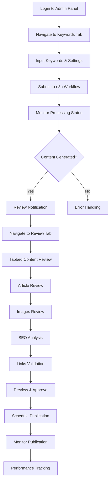
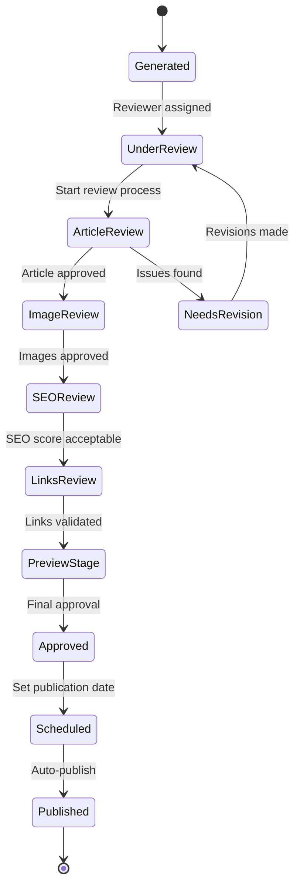

# DirectDrive Admin Panel User Flow Documentation
*Complete user journey mapping and interaction patterns*

## Overview

This document maps the complete user workflows for the DirectDrive Authority Engine admin panel, from keyword input to content publication, with detailed interaction patterns and state transitions.

## 1. Primary User Flows

### 1.1 Content Creation Workflow



### 1.2 Review and Approval Process



## 2. Detailed User Journey Maps

### 2.1 Content Manager Journey

**User Persona**: Sarah - DirectDrive Content Manager  
**Goal**: Efficiently review and publish 5-8 articles per week  
**Pain Points**: Time constraints, maintaining quality standards

#### Morning Workflow (30 minutes)
1. **Dashboard Check** (2 minutes)
   ```typescript
   // User sees upon login
   interface DashboardOverview {
     pendingReviews: number;        // 3 articles awaiting review
     scheduledPosts: number;        // 5 posts scheduled this week
     workflowStatus: 'running' | 'idle' | 'error';
     lastGeneratedContent: Date;
     urgentActions: Action[];       // High priority items
   }
   ```

2. **Priority Assessment** (3 minutes)
   - Review notification center
   - Check urgent/high-priority content
   - Identify blocking issues

3. **Content Review Session** (20-25 minutes)
   - Process 2-3 articles through tabbed review
   - Focus on quick wins and high-impact edits
   - Approve content meeting standards

#### Detailed Review Process per Article (5-8 minutes)

**Article Tab** (2 minutes):
```typescript
interface ArticleReviewActions {
  quickScan: {
    readingTime: '30 seconds';
    checkpoints: [
      'DirectDrive mentions present',
      'Kurdistan/logistics context',
      'Professional tone maintained',
      'Call-to-action included'
    ];
  };
  
  editingActions: {
    typoCorrection: 'Auto-highlight suspected errors';
    factChecking: 'Verify logistics information';
    brandAlignment: 'Ensure DirectDrive positioning';
    optimization: 'Improve readability and flow';
  };
}
```

**SEO Tab** (1 minute):
```typescript
interface SEOQuickCheck {
  scoreThreshold: 85;
  criticalFactors: [
    'Primary keyword in title',
    'Meta description under 160 chars',
    'Heading structure (H1, H2, H3)',
    'Internal links to DirectDrive services'
  ];
  autoFixes: [
    'Keyword density optimization',
    'Meta description generation',
    'Alt text suggestions'
  ];
}
```

**Preview & Approve** (1-2 minutes):
```typescript
interface ApprovalProcess {
  finalChecks: [
    'Mobile preview looks good',
    'Social media cards render correctly',
    'Publication date aligns with calendar',
    'No conflicts with scheduled content'
  ];
  
  approvalActions: {
    quickApprove: 'One-click for high-scoring content';
    scheduleAndApprove: 'Set date and approve simultaneously';
    requestRevisions: 'Send back with specific feedback';
  };
}
```

### 2.2 Marketing Manager Journey

**User Persona**: Ahmed - DirectDrive Marketing Manager  
**Goal**: Strategic content planning and performance optimization  
**Focus**: Calendar management, competitive positioning

#### Weekly Planning Session (60 minutes)

1. **Performance Review** (15 minutes)
   ```typescript
   interface PerformanceAnalysis {
     weeklyMetrics: {
       articlesPublished: number;
       avgSEOScore: number;
       citationImprovement: number;
       engagementMetrics: EngagementData;
     };
     
     competitiveInsights: {
       marketPosition: 'improved' | 'stable' | 'declining';
       keywordRankings: KeywordRanking[];
       citationGaps: string[];
     };
   }
   ```

2. **Calendar Planning** (20 minutes)
   - Review upcoming business events
   - Align content with seasonal logistics trends
   - Identify keyword gaps and opportunities

3. **Content Strategy Adjustment** (25 minutes)
   - Analyze top-performing content themes
   - Plan keyword priorities for next sprint
   - Set content goals and KPIs

### 2.3 Administrator Journey

**User Persona**: Mojtaba - System Administrator  
**Goal**: Monitor system health and optimize workflows  
**Focus**: Technical performance, integration monitoring

#### Daily Health Check (15 minutes)

```typescript
interface SystemHealthCheck {
  workflowStatus: {
    n8nIntegration: 'healthy' | 'degraded' | 'failed';
    supabaseConnection: 'connected' | 'slow' | 'disconnected';
    aiModelResponses: 'normal' | 'slow' | 'rate-limited';
    publicationPipeline: 'operational' | 'backlogged' | 'error';
  };
  
  performanceMetrics: {
    avgProcessingTime: number;
    errorRate: number;
    queueBacklog: number;
    userActivityLevel: 'low' | 'normal' | 'high';
  };
}
```

## 3. Interaction Patterns and UI Behaviors

### 3.1 Smart Notifications System

```typescript
interface NotificationBehavior {
  contextual: {
    // Show relevant notifications based on current tab
    tabContext: 'keywords' | 'review' | 'queue' | 'analytics';
    relevantOnly: boolean;
    actionable: boolean;
  };
  
  priority: {
    urgent: {
      display: 'immediate_popup';
      sound: true;
      persistence: 'until_acknowledged';
      channels: ['in-app', 'telegram', 'email'];
    };
    
    normal: {
      display: 'notification_bell';
      sound: false;
      persistence: '24_hours';
      channels: ['in-app', 'telegram'];
    };
    
    info: {
      display: 'badge_only';
      sound: false;
      persistence: '7_days';
      channels: ['in-app'];
    };
  };
}
```

### 3.2 Progressive Disclosure Pattern

```typescript
interface ProgressiveDisclosure {
  keywordInput: {
    basic: ['Primary Keyword', 'Language', 'Priority'];
    advanced: ['Secondary Keywords', 'Content Type', 'Target Audience'];
    expert: ['Business Context', 'Competitor Analysis', 'Custom Prompts'];
  };
  
  contentReview: {
    essential: ['Content Quality', 'SEO Score', 'Approval Status'];
    detailed: ['Readability Metrics', 'Keyword Analysis', 'Link Validation'];
    technical: ['HTML Structure', 'Performance Score', 'Accessibility'];
  };
}
```

### 3.3 Keyboard Shortcuts and Power User Features

```typescript
interface KeyboardShortcuts {
  global: {
    'Cmd+K': 'Quick search/command palette';
    'Cmd+N': 'New keyword input';
    'Cmd+S': 'Save current work';
    'Esc': 'Close modal/cancel action';
  };
  
  review: {
    'Tab': 'Next review section';
    'Shift+Tab': 'Previous review section';
    'Cmd+Enter': 'Approve and continue';
    'Cmd+R': 'Request revisions';
    'A': 'Approve current item';
    'E': 'Edit content';
    'P': 'Preview';
  };
  
  queue: {
    'D': 'Duplicate item';
    'Del': 'Delete item';
    'S': 'Schedule item';
    'Cmd+Up': 'Increase priority';
    'Cmd+Down': 'Decrease priority';
  };
}
```

## 4. State Management and Data Flow

### 4.1 Application State Architecture

```typescript
interface AdminPanelState {
  // Current user context
  user: {
    id: string;
    role: 'admin' | 'manager' | 'reviewer';
    preferences: UserPreferences;
    currentSession: SessionData;
  };
  
  // Active content management
  content: {
    activeReview: ContentItem | null;
    reviewQueue: ContentItem[];
    publishingQueue: ScheduledItem[];
    keywords: KeywordData[];
  };
  
  // System status
  system: {
    workflowStatus: WorkflowStatus;
    notifications: Notification[];
    errors: ErrorState[];
    performance: PerformanceMetrics;
  };
  
  // UI state
  ui: {
    activeTab: TabId;
    sidebarCollapsed: boolean;
    modalsOpen: ModalState[];
    filters: FilterState;
  };
}
```

### 4.2 Data Synchronization Patterns

```typescript
interface DataSyncStrategy {
  // Optimistic updates for immediate feedback
  optimisticUpdates: {
    contentEdits: 'immediate_local_update';
    statusChanges: 'immediate_ui_update';
    queueReordering: 'immediate_visual_update';
  };
  
  // Background synchronization
  backgroundSync: {
    contentSave: 'every_30_seconds';
    statusCheck: 'every_10_seconds';
    notificationPoll: 'real_time_websocket';
  };
  
  // Conflict resolution
  conflictResolution: {
    strategy: 'last_write_wins' | 'merge' | 'user_choice';
    notifications: 'show_conflict_dialog';
    rollback: 'maintain_version_history';
  };
}
```

## 5. Error Handling and Recovery Flows

### 5.1 Error Categories and User Experience

```typescript
interface ErrorHandling {
  network: {
    detection: 'connection_timeout' | 'server_error' | 'rate_limit';
    userFeedback: 'inline_message' | 'toast_notification' | 'modal_dialog';
    recovery: 'auto_retry' | 'manual_retry' | 'offline_mode';
  };
  
  validation: {
    clientSide: 'immediate_inline_feedback';
    serverSide: 'form_error_summary';
    prevention: 'progressive_validation';
  };
  
  workflow: {
    n8nFailure: 'clear_error_message' | 'retry_options' | 'manual_intervention';
    aiTimeout: 'progress_indicator' | 'estimated_time' | 'cancel_option';
    publishFailure: 'detailed_log' | 'retry_mechanism' | 'rollback_option';
  };
}
```

### 5.2 Recovery Mechanisms

```typescript
interface RecoveryFlows {
  autoSave: {
    frequency: '30_seconds';
    storage: 'local_storage' | 'indexed_db';
    recovery: 'on_page_reload' | 'session_restore';
  };
  
  workflowRestart: {
    trigger: 'user_action' | 'automatic_retry';
    dataPreservation: 'maintain_inputs' | 'reset_state';
    notification: 'progress_updates' | 'completion_alert';
  };
  
  dataBackup: {
    frequency: 'real_time' | 'periodic';
    scope: 'user_data' | 'system_state' | 'both';
    restoration: 'point_in_time' | 'latest_backup';
  };
}
```

## 6. Performance Optimization Patterns

### 6.1 Loading States and Feedback

```typescript
interface LoadingPatterns {
  contentLoading: {
    skeleton: 'show_content_structure';
    progressive: 'load_critical_first';
    lazy: 'viewport_based_loading';
  };
  
  formSubmission: {
    immediate: 'disable_submit_button';
    progress: 'show_processing_steps';
    completion: 'success_confirmation';
  };
  
  dataFetching: {
    caching: 'intelligent_cache_strategy';
    prefetching: 'predictive_data_loading';
    pagination: 'virtual_scrolling';
  };
}
```

### 6.2 User Experience Optimization

```typescript
interface UXOptimization {
  navigation: {
    preloading: 'next_likely_tab';
    caching: 'visited_content';
    transitions: 'smooth_animations';
  };
  
  feedback: {
    immediate: 'visual_state_changes';
    contextual: 'relevant_help_text';
    progressive: 'guided_workflows';
  };
  
  personalization: {
    layout: 'remember_user_preferences';
    content: 'show_relevant_sections';
    workflows: 'optimize_frequent_actions';
  };
}
```

## 7. Mobile and Touch Interactions

### 7.1 Mobile-Specific Workflows

```typescript
interface MobileWorkflows {
  contentReview: {
    swipeNavigation: 'between_tabs';
    touchTargets: 'minimum_44px';
    gestureControls: 'pinch_zoom' | 'swipe_actions';
  };
  
  keywordInput: {
    adaptiveKeyboard: 'context_aware';
    voiceInput: 'speech_to_text';
    autoComplete: 'intelligent_suggestions';
  };
  
  notifications: {
    pushNotifications: 'permission_request';
    actionableNotifications: 'quick_actions';
    badgeUpdates: 'unread_count';
  };
}
```

### 7.2 Touch-Optimized Components

```typescript
interface TouchComponents {
  buttons: {
    minSize: '44px';
    spacing: '8px_minimum';
    feedback: 'haptic_touch_response';
  };
  
  dragAndDrop: {
    dragHandles: 'visible_grip_indicators';
    dropZones: 'clear_visual_boundaries';
    feedback: 'real_time_positioning';
  };
  
  forms: {
    inputFields: 'large_touch_targets';
    validation: 'immediate_feedback';
    submission: 'loading_states';
  };
}
```

## 8. Accessibility and Inclusive Design

### 8.1 Screen Reader Navigation

```typescript
interface ScreenReaderSupport {
  landmarks: {
    header: 'site_header';
    navigation: 'main_navigation';
    main: 'content_area';
    aside: 'supplementary_info';
    footer: 'site_footer';
  };
  
  headings: {
    structure: 'logical_hierarchy';
    descriptive: 'clear_section_titles';
    navigation: 'skip_links';
  };
  
  formLabels: {
    explicit: 'label_element_association';
    descriptive: 'clear_purpose_description';
    errors: 'accessible_error_messages';
  };
}
```

### 8.2 Keyboard Navigation Patterns

```typescript
interface KeyboardNavigation {
  focusManagement: {
    visible: 'clear_focus_indicators';
    logical: 'tab_order_follows_visual';
    trapped: 'modal_focus_containment';
  };
  
  shortcuts: {
    discoverable: 'help_documentation';
    consistent: 'standard_conventions';
    customizable: 'user_preferences';
  };
  
  skipLinks: {
    mainContent: 'bypass_navigation';
    sections: 'quick_section_access';
    forms: 'skip_to_errors';
  };
}
```

## 9. Multi-language and RTL Support

### 9.1 Language-Specific Flows

```typescript
interface MultiLanguageSupport {
  interface: {
    detection: 'browser_language' | 'user_preference';
    switching: 'persistent_selection';
    fallback: 'english_default';
  };
  
  content: {
    rtlLanguages: ['ar', 'ku']; // Arabic, Kurdish
    ltrLanguages: ['en', 'fa']; // English, Farsi
    directionSwitching: 'automatic_layout_adjustment';
  };
  
  forms: {
    validation: 'language_specific_rules';
    inputMethod: 'appropriate_keyboards';
    dateFormats: 'locale_specific';
  };
}
```

### 9.2 Cultural Adaptation

```typescript
interface CulturalAdaptation {
  calendar: {
    gregorian: 'default_international';
    hijri: 'arabic_content';
    persian: 'farsi_content';
  };
  
  numbers: {
    westernArabic: '0123456789';
    easternArabic: '٠١٢٣٤٥٦٧٨٩';
    persian: '۰۱۲۳۴۵۶۷۸۹';
  };
  
  textDirection: {
    layout: 'bidirectional_support';
    alignment: 'natural_reading_flow';
    icons: 'direction_appropriate';
  };
}
```

## 10. Analytics and User Behavior Tracking

### 10.1 User Journey Analytics

```typescript
interface UserAnalytics {
  journeyTracking: {
    entryPoints: 'track_user_entry';
    pathAnalysis: 'common_workflow_patterns';
    exitPoints: 'identify_abandonment';
    timeSpent: 'task_completion_time';
  };
  
  performanceMetrics: {
    taskCompletion: 'success_rate_by_role';
    errorEncounters: 'error_frequency_analysis';
    featureUsage: 'adoption_rate_tracking';
    satisfaction: 'user_feedback_collection';
  };
}
```

### 10.2 Optimization Insights

```typescript
interface OptimizationInsights {
  bottlenecks: {
    identification: 'slow_interaction_points';
    measurement: 'time_to_complete_actions';
    optimization: 'ui_improvement_suggestions';
  };
  
  userPreferences: {
    tracking: 'feature_usage_patterns';
    personalization: 'adaptive_interface_suggestions';
    feedback: 'user_satisfaction_surveys';
  };
}
```

---

**Document Version**: 1.0  
**Last Updated**: August 20, 2025  
**Next Review**: September 20, 2025  
**Approval**: Frontend Team Lead, UX Design Team